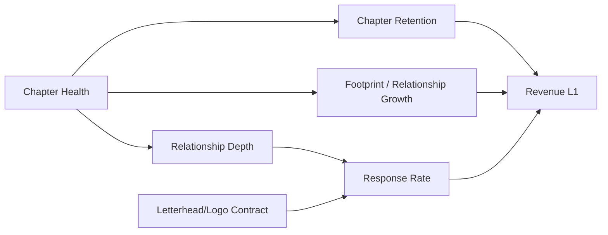
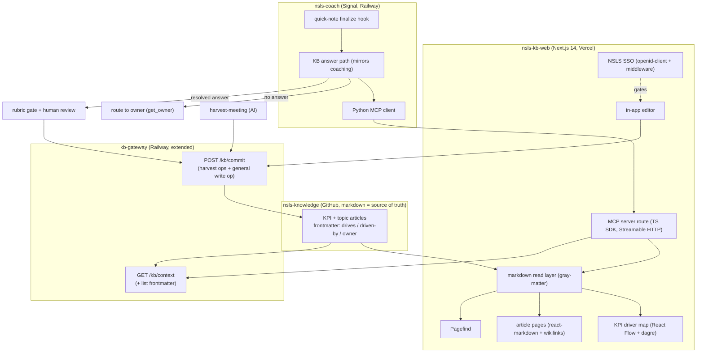
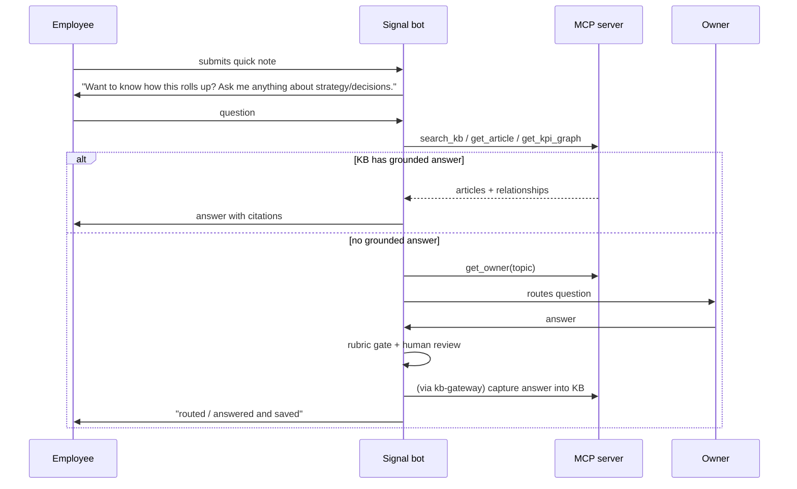

# NSLS Knowledge Base Website, KPI Driver Map, and MCP Query Layer - Plan

## Goal Capsule

- **Objective:** Make the `thensls/nsls-knowledge` markdown KB browsable and understandable to employees through a website centered on an interactive KPI driver map, queryable by the Signal bot through an MCP server, and kept current by both AI (meeting harvest) and humans (git-backed browser editing) — with git remaining the single source of truth.
- **Product authority:** Marcus Vance.
- **Open blockers:** None blocking planning. Tech direction is set (custom Next.js app on Vercel; in-app editor committing through `kb-gateway` gated by NSLS SSO; v1 shows structure + definitions + narratives, not live values). Remaining items are deferred to planning — see Outstanding Questions.

## Product Contract

### Summary

Build a website that renders the existing `nsls-knowledge` markdown articles and presents an interactive KPI driver map — clickable nodes for each metric, edges showing which metric drives which — so employees can see how their work rolls up into revenue. Add an MCP server exposing a shared KB query core so the Signal bot answers strategy and decision questions on quick-note submission and routes gaps to the owning stakeholder, capturing answers back into the KB. Humans edit articles in-browser through an editor that commits via an extended `kb-gateway` write path.

### Problem Frame

NSLS's institutional knowledge is real but hard to act on. The `nsls-knowledge` repo has a clean, AI-writable foundation — flat markdown, a stable frontmatter schema, `kb-gateway` for parsed reads and GitHub-App-backed writes, and `harvest-meeting` writing decisions in from Fathom — but its topic files are mostly empty stubs, there is no way to browse it, and nothing connects a metric to the metrics it drives. Employees submitting quick notes have no line of sight into how their work rolls up, what's been decided, or what the strategy is; and when they have a question, there is no path from question to an answer grounded in the KB, nor a way to capture that answer so the next person benefits.

AFFiNE was considered as the editing/visualization surface but rejected: it stores documents as Yjs CRDT binary blobs (not diffable markdown), has no official API, imposes a 10-seat self-host cap that blocks a 60-person org, and only round-trips markdown lossily. Adopting it would remove the exact property — plain-markdown, AI-writable, git-truth — that makes the current stack valuable.

### Key Decisions

- **Markdown-in-git stays the store; AFFiNE is dropped.** The AI-writable requirement is already met by the current stack. AFFiNE's CRDT store, missing API, and seat cap would regress it.
- **Reuse `kb-gateway`, don't rebuild.** Its `GET /kb/context` parser and GitHub-App commit path are built and tested. The MCP server and CMS layer on top; the write path is not re-implemented.
- **Content before site.** The KPI articles are authored first, because the topic sections are empty stubs today — a site-first order would ship structure with no substance.
- **Interactive custom graph over a static diagram.** The driver map is a clickable, navigable graph derived from frontmatter relationships, not a hand-drawn or static Mermaid image.
- **In-app editor over a generic CMS.** Rather than Decap/TinaCMS, the editor is built into the app and commits through an extended `kb-gateway` write op — one write path shared by humans and AI, gated by NSLS SSO, no OAuth proxy or second store.
- **v1 is definitions + narratives, not live values.** The map and articles carry each KPI's definition, its driver relationships, and harvest-sourced narrative; live metric readings stay in the source systems and are a deferred overlay.
- **Custom Next.js app on Vercel.** The interactive graph is central, so the site is a custom app that owns the graph, search, and editor natively rather than a static-site generator with a bolted-on graph component.
- **One write path for AI and humans.** The in-app editor commits through `kb-gateway`'s existing GitHub-App write path, gated by NSLS SSO (`nsls-auth`). Humans and the harvest/bot AI write the KB the same way — no second write path, no OAuth proxy.

### Actors

- A1. **Employee** — submits quick notes via Signal; asks strategy/decision questions; reads the KB site.
- A2. **Stakeholder / topic owner** — owns a metric or topic; answers routed questions; edits articles.
- A3. **SLT author** — has write access to the company KB; authors/updates KPI definitions.
- A4. **Signal bot (AI)** — prompts on quick-note submission, answers from the KB via MCP, routes gaps.
- A5. **Harvest pipeline (AI)** — `harvest-meeting`; appends meeting-sourced narratives/decisions into KB articles.
- A6. **`kb-gateway`** — the read parser and GitHub-App write service the MCP server and CMS build on.

### Requirements

**KPI content model**

- R1. Each KPI is a KB markdown article carrying: a definition, how it is measured, its driver relationships, a decisions log, and a narrative section fed by meeting harvest.
- R2. Metric relationships are machine-readable via the KB's existing `feeds:` wikilink-list field (causal upstream→downstream, DAG shape) plus `parent:` (containment); the graph is derived from `feeds` + `parent`. (Supersedes the original `drives:`/`driven-by:` design — the live schema already defined `feeds:` and 7+ files use it; one directional field with reverse edges derived at read time.)
- R3. Meeting-harvest narratives append into a KPI article using the existing harvest append format (dated line + Fathom deep-link); KPI definitions are updatable by humans and AI, with git holding version history.
- R4. The initial KPI set models the driver chain: Revenue (L1) is driven by Chapter Retention and by Footprint/Relationship Growth; both are driven by Chapter Health; Chapter Health also deepens Relationship, which raises Response Rate, which drives Revenue; a school letterhead/logo contract raises Response Rate and thereby Revenue.

**Website and interactive driver map**

- R5. The site renders every KB article as a browsable page, resolving `[[wikilinks]]` to internal links.
- R6. An interactive KPI driver map renders nodes (KPIs) and directed edges (drives-relationships) derived from frontmatter; nodes are clickable through to the article; the map is the site's primary navigation into the KPI content.
- R7. Full-text search spans all articles.
- R8. An in-app browser editor lets NSLS-SSO-authorized humans create and edit articles; edits commit through `kb-gateway`'s GitHub-App write path so the repo stays the source of truth and humans share the AI write path.

**MCP query layer**

- R9. An MCP server exposes the KB for AI clients (the Signal bot first), reusing `kb-gateway`'s parsed read path rather than a new parser.
- R10. MCP tools cover: full-text search, read a single article, read the KPI graph/relationships, and resolve the owning stakeholder for a topic or metric.

**Signal bot Q&A loop**

- R11. On quick-note submission, the bot prompts the employee — offering to explain decisions, the strategy, or how their work rolls up, and inviting new questions.
- R12. The bot answers from the KB via MCP; when the KB has no answer, it routes the question to the owning stakeholder (via R15's owner map).
- R13. Questions and their answers are tracked; a resolved answer is proposed back into the KB, gated by the sensitive-content rubric and a human review step before it lands in the shared repo.

**Governance and schema hygiene**

- R14. The sensitive-content rubric section is added to the live KB `CLAUDE.md`, and the seed-vs-harvest frontmatter dialects are reconciled to one schema, so anything reading the KB programmatically behaves consistently.
- R15. A stakeholder owner map (topic/metric → owner) exists and drives both routing (R12) and the MCP owner lookup (R10).

### Visualizations

The driver map the KPI content and the graph view both encode (conceptual — the site renders it interactively; this is the relationship structure):



### Acceptance Examples

- AE1. **Covers R12.** An employee asks "how does chapter health affect revenue?" → the bot returns the KB's Chapter Health → Retention/Relationship → Revenue chain with the article's definition and cited decisions.
- AE2. **Covers R12, R15.** An employee asks a question the KB does not answer → the bot identifies the owning stakeholder for that topic and routes the question to them, telling the employee it has been routed.
- AE3. **Covers R13.** A stakeholder answers a routed question → the answer is proposed as a KB edit, passes the sensitive-content rubric, and lands only after human review; a rubric-flagged answer is held, not written.
- AE4. **Covers R6.** A user opens the driver map, clicks the Response Rate node → lands on the Response Rate article showing its definition, what drives it (Relationship Depth, letterhead/logo contract), and what it drives (Revenue).

### Success Criteria

- Employees receive KB-grounded answers to strategy/decision/roll-up questions in Signal, with citations to articles.
- The driver map is navigable end-to-end: every KPI in R4 is reachable and its drives/driven-by edges are correct.
- Every human and AI edit lands as a git commit; the GitHub repo remains the single source of truth.
- No unannounced exec/comp/personnel content is served by the bot or written back into the shared KB (the rubric holds on both read and write).

### Scope Boundaries

**Deferred for later**
- Piping live metric *values* into the map (a BI/dashboard overlay). v1 is definitions, relationships, and narratives — structure, not live numbers.
- Auth/SSO specifics for the CMS and site beyond "authorized humans can edit."
- Mobile-optimized layouts.

**Outside this product's identity**
- Not a BI/analytics tool — live metric values stay in PostHog/Airtable/HubSpot; this explains what metrics mean and how they connect, not their current readings.
- Not a general company wiki for all documents, and not a replacement for individuals' private Obsidian KBs.

### Dependencies / Assumptions

- `kb-gateway` is deployed and reachable (deploy status unverified from disk — confirm before wiring the MCP server to it).
- Signal bot infrastructure (Railway) and GitHub App credentials (Doppler-injected) are available.
- `nsls-auth` can gate the editor for the ~60-person editor set (OIDC via auth.nsls.org); client registration for this app is a planning task.
- **Assumption:** metric values live in existing systems; the KB holds definitions, relationships, and narratives. If v1 must show live values, R6 and the deferred BI item change materially.

### Outstanding Questions

**Deferred to planning**
- MCP transport (stdio vs. HTTP/SSE) and how the Signal bot process connects to it.
- Whether the MCP server wraps `kb-gateway`'s HTTP API or reads the parsed KB directly.
- The review-step mechanics for bot-captured answers (who reviews, where the queue lives).
- The graph library for the interactive map (e.g., React Flow vs. D3 vs. Cytoscape).
- Which NSLS-SSO role/claim authorizes KB editing, and how it maps onto `kb-gateway`'s token registry.

### Sources / Research

- `nsls-knowledge` repo: ~30 flat markdown topic files, Obsidian `[[wikilinks]]`, frontmatter schema (`type/category/parent/related/owner/airtable-tag-id/last-updated`); Current State / Key Decisions / Open Questions sections are largely empty stubs. Two frontmatter dialects in play (seed vs. harvest). Live `CLAUDE.md` is missing the `## Sensitive-Content Rubric` section that read/write paths expect.
- `kb-gateway` (`nsls-skills/kb-gateway`): aiohttp REST service, GitHub-App-backed. `GET /kb/context` returns the fully parsed KB as JSON; `POST /kb/commit` applies edits atomically with ref-move concurrency detection. Railway-deployed; complete and tested on disk, live status unconfirmed.
- `harvest-meeting` skill (`nsls-personal-toolkit/skills/harvest-meeting`): writes decisions/state-changes from Fathom into KB articles (SLT → pushed company repo; others → local-only). Append format: `- YYYY-MM-DD: <text> ([▶](<fathom_url>?timestamp=<sec>))`.
- AFFiNE research verdict: CRDT (Yjs) binary storage, no official content API (2-year-stale request thread), 10-seat self-host cap, source-available EE backend license, lossy markdown round-trip via one community MCP server. Not viable as an AI-writable markdown-source-of-truth KB. Alternatives that are: static-site generators (markdown = truth, Mermaid for diagrams) and Outline (wiki UI + REST API, markdown in a DB).
- **Planning research (2026-07-08), grounded in the real repos:**
  - `kb-gateway` interfaces — `GET /kb/context` → `{topics:{slug:{frontmatter,current_state,key_decisions,open_questions}}, rubric, head_sha}`; `POST /kb/commit` with candidate shape + `current_state_base_sha256` guard + `RefMoved` retry; bearer auth via `sha256(token)` lookup in `KB_TOKENS` env (no per-client scopes; any token treated as SLT). `kb_parse.py` frontmatter parse is naive `partition(":")` — **does not read YAML lists** (so `drives`/`driven-by` won't flow through `/kb/context` without a parser change). `kb_edits.py` write ops are harvest-shaped: append Key Decision, append Open Question, REFINEMENT replace, SHA-guarded Current State replace, scaffold new file — **no general section/frontmatter edit**.
  - `nsls-knowledge` — seed dialect uniform across 30 files (`type: knowledge` + `category` + `airtable-tag-id` + `topic-mentions`); harvest dialect (`type: l3` + `status: stub`) used by no file yet; `drives`/`driven-by` absent; `## Sensitive-Content Rubric` absent from `CLAUDE.md` (so `/kb/context` returns `rubric: ""`).
  - `nsls-coach` (Signal bot) — Python, Slack-Bolt async, Socket Mode, Railway. Roll-up-prompt hook point = the quick-note finalize confirmation in `handlers/quick_notes.py`. Calls Claude over **raw HTTP** (`services/quick_notes_intent.py`); reaches its data service over **HTTP `/api/mcp/*`** (bearer + `?as=` scoping, `services/signal_mcp.py`) — **does not speak the MCP wire protocol** (a client is net-new). Existing coaching-Q&A path (`handlers/coaching.py` → answered/not_owned/ungrounded) is the model for the KB answer path.
  - House Next.js pattern = `track-studio` (Next.js 14 App Router, React 18, Tailwind v3.4 brand tokens, `@/*` alias). NSLS SSO via `openid-client` v6 + `jose` JWE session cookie + `middleware.ts` gating; client registration is admin-gated (Tier 3) with a "pending" caveat (app degrades to `auth_not_configured` until the secret lands in Doppler). Read env at call-time so `next build` passes with placeholders.
  - External: official `@modelcontextprotocol/sdk` (TS) over **Streamable HTTP** (stdio/SSE rejected); React Flow (`@xyflow/react` v12) + **dagre** for the DAG; **Pagefind** post-build search; `react-markdown` + `remark-gfm` + `remark-wiki-link` + `gray-matter` for rendering in Server Components.

---

## Planning Contract

**Target repos (multiple).** File paths below are repo-relative within the repo named on each unit:
- `nsls-knowledge` — the KB content + `CLAUDE.md`.
- `kb-gateway` — the read/write service (extended here).
- `nsls-coach` — the Signal bot (Q&A loop wired in).
- `nsls-kb-web` — **new** repo: the Next.js website + MCP server.

**Product Contract preservation:** Product Contract unchanged in intent. Two HOW-level clarifications made during planning, not scope changes: R9's "reusing kb-gateway's parsed read path" is refined — the *website* reads repo markdown directly (full bodies + YAML-list frontmatter the gateway's naive parser can't provide), while the MCP server and bot use a shared query core; R8's editor commits through an *extended* kb-gateway write op (general section/frontmatter edit added in U6). Three planning decisions confirmed with the user: MCP server built in v1 (not deferred), kb-gateway extended for general editing, all four phases in v1.

### Key Technical Decisions

- **KTD1 — Reuse kb-gateway; the website reads markdown directly.** Writes (all actors) go through `kb-gateway`. Reads split by consumer: the website reads the repo markdown itself (`gray-matter`) for full article bodies and `feeds`/`parent`/`related` relationships; the MCP server/bot use a shared query core (which may call `/kb/context` for the harvest-shaped sections plus its own frontmatter read for graph edges). Rationale: the gateway's naive parser exposes only four sections and can't read YAML lists.
- **KTD2 — Extend kb-gateway minimally, twice.** (a) `kb_parse.py`: parse `feeds`/`related` (and other list-valued fields) as lists so `/kb/context` carries graph edges. (b) `kb_edits.py`: add a general SHA-guarded section/frontmatter write op so the in-app editor can edit definitions, narratives, and frontmatter. Preserve all existing harvest ops and the `current_state_base_sha256` concurrency guard. Register a website token and an MCP-server token in `KB_TOKENS`.
- **KTD3 — MCP server: official TS SDK, Streamable HTTP, bearer-gated, wrapping a shared query core.** Tools: `search_kb`, `get_article`, `get_kpi_graph`, `get_owner`. Hosted as a route handler in the Next app on Vercel using the SDK's stateless Streamable HTTP mode (no separate service to run for v1). Bearer token gate for the internal bot; OAuth deferred.
- **KTD4 — Bot gets a Python MCP client.** `nsls-coach` adds an MCP client (Python `mcp` SDK, Streamable HTTP) as a new module mirroring the `services/signal_mcp.py` shape; the KB answer path mirrors `handlers/coaching.py`. Claude calls stay on the existing raw-HTTP pattern.
- **KTD5 — Graph = React Flow + dagre**, client component (`next/dynamic`, `ssr:false`), layout computed in `useMemo`; DAG data fetched server-side from frontmatter and passed as props. elkjs only if edge-crossings get ugly.
- **KTD6 — Search = Pagefind** as a `postbuild` step indexing built pages; UI loaded client-side; served as static assets from Vercel's CDN.
- **KTD7 — Rendering = `react-markdown` + `remark-gfm` + `remark-wiki-link` + `gray-matter`** in async Server Components; `remark-wiki-link` `pageResolver`/`hrefTemplate` maps `[[Metric Name]]` → `/kpi/<slug>`.
- **KTD8 — Auth mirrors track-studio.** `openid-client` v6 + `jose` A256GCM JWE session cookie, `middleware.ts` gates all routes except `/api/auth/*`, identity keyed on `(iss, sub)` never email. Client registration JSON handed to an admin (Tier 3); env read at call-time; graceful `auth_not_configured` until the secret lands in Doppler.
- **KTD9 — Content freshness.** Website reads a build-time checkout of `nsls-knowledge`; a GitHub webhook on commit triggers Vercel on-demand revalidation so harvest/editor commits appear without a manual redeploy.
- **KTD10 — Owner map via frontmatter.** The stakeholder owner lives in each article's `owner:` frontmatter as a person wikilink (`owner: "[[Priya Nakamura]]"` — the live convention); `get_owner` resolves topic→owner from it (stripping the wikilink), with a fallback default owner. No separate owner store.
- **KTD11 — Live schema is richer than planned; carry it.** The KB evolved past the plan's snapshot: ~70 populated files (not 30 stubs), node types `theme|kpi|rubric|sub-rubric|channel|l2|l3`, and fields `lop_level`, `provisional`/`proposed_by`, `collaborators`, `audience`, `harvest_source`/`harvest_model`/`harvest_stats`, `project_home`. The website's frontmatter model and the MCP tools carry these (e.g., the map can badge L1/L2 levels and provisional nodes).

### High-Level Technical Design

Component and data-flow shape:



Bot Q&A sequence:



### Output Structure

New repo `nsls-kb-web` (mirrors track-studio):

```
nsls-kb-web/
  app/
    layout.tsx  globals.css  fonts.ts
    page.tsx                     # landing → driver map
    kpi/[slug]/page.tsx          # KPI article (Server Component)
    article/[slug]/page.tsx      # non-KPI topic article
    map/page.tsx                 # full-screen driver map
    edit/[slug]/page.tsx         # in-app editor (SSO-gated)
    api/auth/{login,callback,logout}/route.ts
    api/edit/route.ts            # proxy → kb-gateway general write op
    mcp/route.ts                 # MCP server (Streamable HTTP)
  components/                    # KpiGraph, ArticleBody, SearchBox, EditorForm
  lib/
    kb/  read.ts model.ts graph.ts wikilinks.ts   # markdown read + graph derive
    kb/query.ts                  # shared query core (used by MCP tools)
    auth/  config.ts session.ts
    gateway.ts                   # kb-gateway client (read + write)
  middleware.ts
  scripts/                       # pagefind postbuild, content sync
  docs/  AUTH_SETUP.md  oidc-client.json
  tailwind.config.ts  next.config.mjs  .env.local.example
```

### Implementation Units

Phased delivery; U-IDs stable. Phases 1–2 unblock 3–5.

#### Phase 1 — Content model & governance (repo: `nsls-knowledge`)

> **Phase 1 status (2026-07-08):** U1 and U2 were found already satisfied by the live repo (schema table with `feeds:` + full rubric in `CLAUDE.md`, verified against kb-gateway's extraction regex). U3 shipped as commit `ec2d628`: `response-rate.md` created (0-2-5-7 curve), `feeds:` edges wired on `chapter-health` and `b2b-conversion`; health→retention was already encoded via `parent:`. The remaining driver-chain concepts mapped to existing nodes (`core-revenue`, `chapter-retention`, `b2b-conversion` = footprint growth, `b2c-conversion` = operational response-rate home), so no other files were created. Units below kept for the record; the `drives`/`driven-by` wording they carry is superseded by `feeds` per R2.

### U1. Define schema v2 and document it

- **Goal:** One reconciled frontmatter schema adding KPI fields and graph edges.
- **Requirements:** R1, R2, R14.
- **Dependencies:** none.
- **Files:** `CLAUDE.md` (schema + writing rules), `_index.md` (note new KPI category if used).
- **Approach:** Reconcile seed vs harvest dialect into one documented schema: keep `type/category/parent/related/owner/last-updated`; add `drives: [[...]]` and `driven-by: [[...]]` list fields and a `kpi: true` marker; define article body sections for KPIs (`## Definition`, `## How It's Measured`, `## Drivers`, `## Narrative`, plus existing `## Key Decisions`, `## Open Questions`). Document that `drives`/`driven-by` are YAML lists (consumed by U5 + the website).
- **Patterns to follow:** existing `CLAUDE.md` writing rules; `_index.md` category headings.
- **Test scenarios:** `Test expectation: none — documentation/schema definition, no runtime behavior.` Verification is that U3 articles parse under U5's updated parser.
- **Verification:** schema documented; a sample KPI file validates against it.

### U2. Add the sensitive-content rubric and reconcile CLAUDE.md

- **Goal:** `## Sensitive-Content Rubric` present so `/kb/context` returns a non-empty rubric and write-back can gate on it.
- **Requirements:** R14, R13.
- **Dependencies:** none.
- **Files:** `CLAUDE.md`.
- **Approach:** Add the `## Sensitive-Content Rubric` section (source the 8 never-write categories from the harvest skill's rubric) using the exact header `kb-gateway` extracts (`config.py:17`).
- **Test scenarios:** Covers R14. `GET /kb/context` against the updated repo returns `rubric` containing the section text (non-empty). Happy path: rubric header present → extracted. Edge: header absent → empty string (regression guard).
- **Verification:** `curl /kb/context` shows populated `rubric`.

### U3. Author the KPI driver-chain articles

- **Goal:** The seven driver-chain KPIs authored with definitions, edges, and seed narratives.
- **Requirements:** R1, R3, R4.
- **Dependencies:** U1.
- **Files:** `revenue.md`, `chapter-retention.md`, `footprint-relationship-growth.md`, `chapter-health.md`, `relationship-depth.md`, `response-rate.md`, `letterhead-logo-contract.md`.
- **Approach:** One file per KPI per schema v2. Encode edges: Chapter Health `drives` Chapter Retention, Footprint/Relationship Growth, Relationship Depth; Relationship Depth `drives` Response Rate; Letterhead/Logo Contract `drives` Response Rate; Chapter Retention, Footprint/Relationship Growth, Response Rate `drive` Revenue. Populate `owner:` per KPI. Reuse existing topic slugs where a KPI overlaps an existing topic (e.g., revenue-strategy) rather than duplicating.
- **Patterns to follow:** existing topic files; harvest append format for narrative lines.
- **Test scenarios:** Covers R4, R6. Graph derived from these files' frontmatter reproduces the driver DAG exactly (7 nodes, 8 edges); every `drives` target has a reciprocal `driven-by` (bidirectional-consistency check); no orphan edges (every referenced slug resolves to a file).
- **Verification:** the derived graph matches the Visualizations diagram.

#### Phase 2 — kb-gateway extensions (repo: `kb-gateway`)

### U5. Parse list frontmatter in kb_parse

- **Goal:** `/kb/context` carries `feeds`/`related` list fields (graph edges).
- **Requirements:** R2, R9, R10.
- **Dependencies:** U1.
- **Files:** `kb_parse.py`, `tests/test_kb_parse.py`.
- **Approach:** Extend frontmatter parsing to recognize list values for `feeds`/`related`/`collaborators` — the live convention is inline JSON-style arrays (`feeds: ["[[a]]", "[[b]]"]`), also accept `-` item lines; keep scalar behavior for other keys. Minimal — do not pull in a full YAML lib unless needed.
- **Patterns to follow:** existing `parse_topic` string handling; existing pytest style.
- **Test scenarios:** happy: file with `feeds:` inline array → parsed to a list of slugs. Edge: empty list, single item, dash-item form, mixed with scalar keys, wikilink quoting variants. Regression: existing scalar frontmatter still parses; `current_state_sha256` unchanged.
- **Verification:** `pytest tests/test_kb_parse.py` green; `/kb/context` on U3 content shows edge arrays.

### U6. Add a general SHA-guarded write op + register client tokens

- **Goal:** Editing any section/frontmatter field through kb-gateway.
- **Requirements:** R8.
- **Dependencies:** none (parallel to U5).
- **Files:** `kb_edits.py`, `handlers.py`, `tests/test_kb_edits.py`, `tests/test_commit_flow.py`, `.env.example`.
- **Approach:** Add a candidate type (e.g., `section: "arbitrary"` with `heading` + `new_body` + `base_sha256`, and a frontmatter-field set op) that replaces a named section body or a frontmatter field under a SHA guard mirroring the Current State pattern. Preserve all existing ops and `RefMoved` retry. Document new `KB_TOKENS` entries for the website and MCP server (sha256 of new bearer tokens).
- **Patterns to follow:** `kb_edits.apply_edit` Current State branch; `handlers.commit` retry loop.
- **Test scenarios:** Covers R8. Happy: edit `## Definition` with correct base sha → committed. Concurrency: stale base sha → rejected with a clear reason (no silent clobber). Frontmatter: set `owner:` → round-trips without reordering other keys. Edge: heading not found → rejected; blank-line collapse preserved. Regression: harvest ops (append decision/question, replace current-state, scaffold) unchanged.
- **Verification:** `pytest` green; dry-run commit shows the intended diff.

#### Phase 3 — Website read side (repo: `nsls-kb-web`)

### U7. Scaffold the Next.js app from the house pattern

- **Goal:** App skeleton mirroring track-studio.
- **Requirements:** R5 (foundation).
- **Dependencies:** none.
- **Files:** `package.json`, `next.config.mjs`, `tailwind.config.ts`, `app/layout.tsx`, `app/globals.css`, `app/fonts.ts`, `tsconfig.json`, `.env.local.example`.
- **Approach:** Next.js 14 App Router, React 18, TypeScript, `@/*` alias, Tailwind v3.4 with NSLS brand tokens copied from track-studio (include the `lib/**` glob). Deploy target Vercel; pin `APP_BASE_URL` for callback URL rebuilding.
- **Patterns to follow:** `track-studio` config files.
- **Test scenarios:** `Test expectation: none — scaffolding.` Build smoke: `next build` passes with placeholder env.
- **Verification:** dev server renders an empty shell; build green.

### U8. KB read + graph-derivation layer

- **Goal:** Read KB markdown, parse frontmatter/body, derive the graph, resolve wikilinks.
- **Requirements:** R5, R6.
- **Dependencies:** U3, U7.
- **Files:** `lib/kb/read.ts`, `lib/kb/model.ts`, `lib/kb/graph.ts`, `lib/kb/wikilinks.ts`, `scripts/sync-content.*`, `app/api/revalidate/route.ts`.
- **Approach:** Read a build-time checkout of `nsls-knowledge` (submodule or sync script); `gray-matter` splits frontmatter/body; `graph.ts` builds nodes/edges from `feeds` (causal) + `parent` (containment), deriving reverse edges at read time; `wikilinks.ts` maps `[[X]]`→`/kpi/<slug>` or `/article/<slug>`. GitHub webhook → `/api/revalidate` for on-demand ISR (KTD9). `import 'server-only'` guard.
- **Patterns to follow:** track-studio `lib/data.ts` server-only facade.
- **Test scenarios:** Covers R6. Graph builder: live-KB fixture → correct nodes/edges from `feeds` + `parent`; edge types distinguished (causal vs containment); unresolved wikilink flagged, not crashing. Frontmatter: list + scalar keys parse, including person-wikilink `owner`. Revalidate: webhook payload triggers revalidation of affected paths.
- **Verification:** a unit test over a fixture KB reproduces the DAG; revalidate route returns 200 on a signed webhook.

### U9. Article pages

- **Goal:** Render KPI and topic articles with wikilinks.
- **Requirements:** R5.
- **Dependencies:** U8.
- **Files:** `app/kpi/[slug]/page.tsx`, `app/article/[slug]/page.tsx`, `components/ArticleBody.tsx`.
- **Approach:** Async Server Components; `react-markdown` + `remark-gfm` + `remark-wiki-link`; render `## Definition`, `## How It's Measured`, `## Drivers` (with in/out edges as links), `## Narrative`, `## Key Decisions`. `generateStaticParams` over all slugs.
- **Patterns to follow:** remark pipeline from research; track-studio RSC data flow.
- **Test scenarios:** Covers R5, AE4. KPI page renders definition + drivers as clickable links; wikilink in body resolves to internal route; missing slug → 404; article with empty section renders without crashing.
- **Verification:** clicking a driver link navigates to the target article.

### U10. Interactive KPI driver map

- **Goal:** Clickable, auto-laid-out driver graph.
- **Requirements:** R6.
- **Dependencies:** U8.
- **Files:** `app/map/page.tsx`, `app/page.tsx`, `components/KpiGraph.tsx`.
- **Approach:** React Flow (`@xyflow/react` v12) in a `'use client'` component via `next/dynamic({ssr:false})`; dagre layout in `useMemo`; KPI nodes = styled cards; `onNodeClick` → `router.push('/kpi/<slug>')`; edges labeled "drives". Data fetched server-side (U8), passed as props.
- **Patterns to follow:** React Flow dagre example.
- **Test scenarios:** Covers R6, AE4. Renders all 7 nodes + 8 edges; node click routes to the article; layout is a readable DAG (no overlapping nodes at this size); empty-graph guard.
- **Verification:** map matches the Visualizations diagram; clicking Response Rate lands on its article.

### U11. Full-text search

- **Goal:** Search across all articles.
- **Requirements:** R7.
- **Dependencies:** U9.
- **Files:** `package.json` (`postbuild`), `components/SearchBox.tsx`, `scripts/pagefind.*`.
- **Approach:** Pagefind post-build indexing of built pages; client-side SearchBox loads the Pagefind bundle; results link to articles.
- **Patterns to follow:** Pagefind Next.js integration.
- **Test scenarios:** Covers R7. Query matching an article title returns it; body-text match returns the right article; no-match returns empty state; index excludes editor/auth routes.
- **Verification:** searching a KPI term returns its article.

### U12. NSLS SSO auth

- **Goal:** Gate the app (and especially the editor) behind NSLS SSO.
- **Requirements:** R8 (gating), Success Criteria (no leak).
- **Dependencies:** U7.
- **Files:** `middleware.ts`, `app/api/auth/{login,callback,logout}/route.ts`, `lib/auth/config.ts`, `lib/auth/session.ts`, `docs/AUTH_SETUP.md`, `docs/oidc-client.json`.
- **Approach:** Mirror track-studio: `openid-client` v6 discovery against `auth.nsls.org`, PKCE + state + nonce per login, JWE session cookie keyed on `(iss, sub)`, middleware gates all but `/api/auth/*`. Draft `oidc-client.json` (web, `client_secret_post`, redirect URIs for the nsls.org subdomain + `*.vercel.app`) and hand to an admin (Tier 3 — never self-register). Read env at call-time; return `auth_not_configured` until the secret is in Doppler.
- **Patterns to follow:** `track-studio/lib/auth/*`, `track-studio/app/api/auth/*`, `nsls-auth` skill templates.
- **Test scenarios:** Covers R8. Unauthed request to a gated route → redirect to login; valid callback → session cookie with `sub`; missing `client_secret` → graceful `auth_not_configured` (not a redirect loop); logout clears session and redirects to branded re-entry; `next build` passes with placeholder secret.
- **Verification:** end-to-end login against auth.nsls.org once the client is registered; graceful degradation before then.

#### Phase 4 — Editing (repo: `nsls-kb-web`)

### U13. In-app editor

- **Goal:** Browser editing of any article section/frontmatter, committing via kb-gateway.
- **Requirements:** R8.
- **Dependencies:** U6, U9, U12.
- **Files:** `app/edit/[slug]/page.tsx`, `app/api/edit/route.ts`, `components/EditorForm.tsx`, `lib/gateway.ts`.
- **Approach:** Editor loads article content + its section base sha; on save, `POST /api/edit` (SSO-gated) proxies to kb-gateway's general write op (U6) with the base sha. `gray-matter` splits frontmatter/body; re-serialize deterministically (preserve untouched frontmatter, only changed fields); enforce trailing newline. Optimistic "saving…" then confirm on commit response; 409 → "changed since you opened it, reload."
- **Patterns to follow:** research git-editing pattern; track-studio server actions/auth.
- **Test scenarios:** Covers R8, AE-none. Edit definition → commit lands; stale sha → 409 surfaced as reload prompt; unauthenticated POST → rejected; frontmatter edit doesn't reorder untouched keys (clean diff); empty edit → no-op.
- **Verification:** editing a KPI definition in the browser produces a single clean commit in `nsls-knowledge`.

#### Phase 5 — MCP server & bot Q&A loop (repos: `nsls-kb-web`, `nsls-coach`)

### U14. Shared query core + MCP server

- **Goal:** MCP server exposing KB query tools.
- **Requirements:** R9, R10.
- **Dependencies:** U5, U8.
- **Files:** `lib/kb/query.ts`, `app/mcp/route.ts`, `components`/lib tests.
- **Approach:** `query.ts` = shared core (search, get_article, get_kpi_graph, get_owner) over the U8 read layer + `/kb/context`. `app/mcp/route.ts` wires `StreamableHTTPServerTransport` + `McpServer` (official TS SDK) in stateless mode (Vercel), registering the four tools; bearer-token gate via header check.
- **Patterns to follow:** MCP TS SDK server docs; research stack decision.
- **Test scenarios:** Covers R9, R10, AE1. `search_kb` returns ranked articles; `get_article` returns body + frontmatter; `get_kpi_graph` returns nodes/edges; `get_owner` resolves owner from frontmatter with default fallback; missing bearer → 401; unknown slug → structured not-found.
- **Verification:** an MCP client lists the four tools and each returns valid results.

### U15. Bot MCP client + KB answer path

- **Goal:** The bot answers KB questions.
- **Requirements:** R12, AE1.
- **Dependencies:** U14.
- **Files:** `services/kb_mcp.py`, `handlers/kb_qa.py`, `config.py` (KB MCP URL + token), tests.
- **Approach:** Add a Python MCP client (`mcp` SDK, Streamable HTTP) mirroring `services/signal_mcp.py` shape. `kb_qa.py` mirrors `handlers/coaching.py`: gather KB context via MCP tools, synthesize with Claude (existing raw-HTTP path), return answered/not_owned/ungrounded with citations.
- **Patterns to follow:** `handlers/coaching.py`, `services/signal_mcp.py`, `services/quick_notes_intent.py`.
- **Test scenarios:** Covers R12, AE1. Grounded question → answer cites the right article(s); ungrounded → returns ungrounded (no hallucination); MCP unavailable → graceful fallback message.
- **Verification:** "how does chapter health affect revenue?" returns the driver chain with citations.

### U16. Roll-up prompt on quick-note finalize

- **Goal:** Invite strategy/decision/roll-up questions after a quick note.
- **Requirements:** R11.
- **Dependencies:** U15.
- **Files:** `handlers/quick_notes.py` (finalize confirmation).
- **Approach:** Append to the finalize confirmation DM a prompt offering to explain decisions/strategy/how their work rolls up, routing replies into `kb_qa.py`.
- **Patterns to follow:** existing finalize confirmation message; state routing in `handle_quick_notes_dm`.
- **Test scenarios:** Covers R11. After finalize, the prompt is sent once; a reply routes to the KB answer path; declining doesn't re-prompt; ad-hoc submissions also offer it.
- **Verification:** submitting a quick note shows the prompt; replying gets a KB answer.

### U17. Route unowned questions + track Q&A

- **Goal:** Gaps go to the owner; Q&A is recorded.
- **Requirements:** R12, R15.
- **Dependencies:** U15.
- **Files:** `handlers/kb_qa.py`, an Airtable table in People Ops base (or `/api/mcp` coaching-interactions style), `config.py`.
- **Approach:** On `not_owned`/`ungrounded`, call `get_owner` and route the question to that owner via DM; tell the asker it's routed. Persist question, answer, owner, status in a `KB Questions` table (People Ops base) mirroring the coaching-interactions pattern.
- **Patterns to follow:** `handle_question_to_kevin`, coaching-interactions storage.
- **Test scenarios:** Covers R12, R15, AE2. Unowned question → routed to resolved owner with asker notified; owner-less topic → default owner; every Q&A persisted with status.
- **Verification:** an unanswerable question reaches the owner and appears in the table.

### U18. Capture resolved answers back into the KB

- **Goal:** Answered questions enrich the KB, gated.
- **Requirements:** R13, AE3.
- **Dependencies:** U6, U17.
- **Files:** `handlers/kb_qa.py`, review-queue surface (Slack DM to reviewer or the KB Questions table status).
- **Approach:** When an owner answers, propose a KB edit (append to the relevant article's Narrative/Key Decisions via kb-gateway). Gate on the sensitive-content rubric (from `/kb/context`); a rubric-flagged answer is held. Require an explicit human review approval (reviewer DM or table flip) before the commit lands.
- **Patterns to follow:** rubric usage in harvest skill; kb-gateway commit.
- **Test scenarios:** Covers R13, AE3. Clean answer → proposed, approved, committed to the right article; rubric-flagged answer → held, not written; approval required before commit (no auto-write); commit uses correct base sha.
- **Verification:** an approved answer lands as a KB commit; a sensitive one is blocked.

### Verification Contract

- **Gate 1 (content):** the graph derived from `nsls-knowledge` frontmatter reproduces the driver DAG (U3 test); `/kb/context` returns a non-empty `rubric` (U2) and edge arrays (U5).
- **Gate 2 (gateway):** `pytest` green in `kb-gateway` including new list-parse and general-write tests; SHA-guarded writes reject stale bases.
- **Gate 3 (website):** `next build` green; map + article + search render; unauthenticated access to gated routes redirects; auth degrades gracefully pre-registration.
- **Gate 4 (editor):** a browser edit produces one clean commit; stale-sha edit surfaces a reload prompt.
- **Gate 5 (bot loop):** grounded question → cited answer; unowned question → routed to owner + recorded; approved answer → KB commit; rubric-flagged answer → blocked.
- Each unit's enumerated test scenarios pass.

### Definition of Done

- All 18 units complete with their test scenarios passing and the five verification gates green.
- The seven driver-chain KPIs are authored and the interactive map renders them with correct edges.
- The Signal bot prompts on quick-note finalize, answers grounded KB questions with citations, routes gaps to owners, and captures approved answers back — with the sensitive-content rubric enforced on read and write.
- The website is deployed on Vercel behind NSLS SSO (or gracefully awaiting client registration), reading live from `nsls-knowledge`.
- kb-gateway extensions are deployed on Railway; website and MCP-server tokens are registered in `KB_TOKENS`.

### Risks & Dependencies

- **kb-gateway live status unverified** — confirm the Railway deployment is running before wiring reads/writes; the code is tested on disk but deploy state was not confirmed.
- **OIDC client registration is admin-gated (Tier 3)** and may lag; the app must ship with graceful `auth_not_configured` so build/deploy isn't blocked on the secret.
- **MCP-on-Vercel is stateless** — long-lived streaming sessions aren't guaranteed; if the bot needs persistent sessions, move `app/mcp/route.ts` to a small Railway service (same query core, no rework).
- **Naive-parser blast radius** — the U5 list-parse change touches the shared parser; the regression tests guard existing scalar behavior. Coordinate with the harvest pipeline (also a kb-gateway consumer).
- **Write-back sensitivity** — U18 puts employee-sourced content into the shared company KB; the rubric gate + mandatory human review are the controls. Do not auto-commit.
- **Content authoring is partly human** — U3's KPI definitions need SLT/Marcus input; the plan structures and seeds them but the substance is a content task, not just code.
