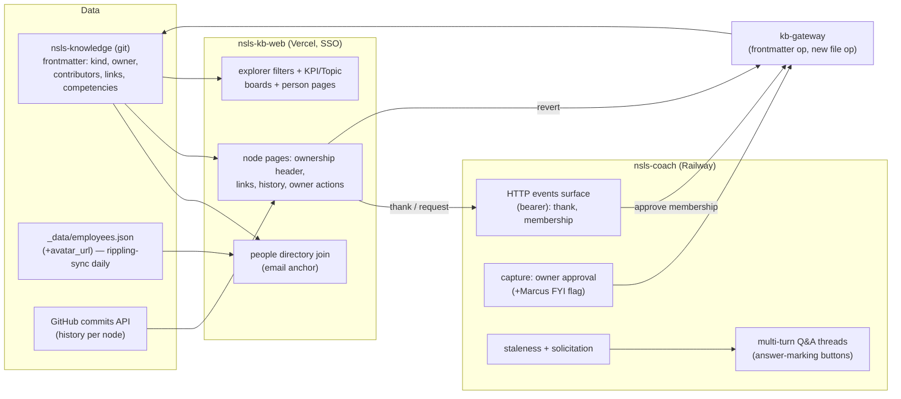
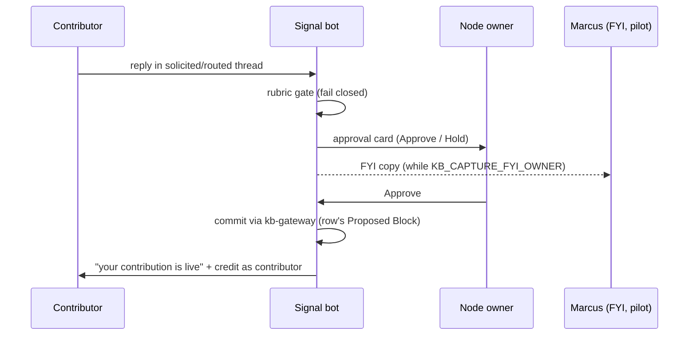

# KB People Layer - Plan

## Goal Capsule

- **Objective:** Make ownership of every KB node visible, curated, and self-organizing — accountable owners with avatars, contributor/expert lists, per-person views, edit history with owner-controlled revert/thank, and a Signal loop that solicits, clarifies, and owner-approves contributions.
- **Product authority:** Marcus. Owner-approval decentralization and the competency-routing model are his explicit calls from the 2026-07-10 dialogue.
- **Open blockers:** none. The competency map (HR-Ops Airtable) does not exist yet — competency-dependent behavior ships behind an activation gate (U17); everything else lands without it.
- **Product Contract preservation:** changed: R2 (owner cardinality clarified to at-most-one — ownerless was already the designed-for state everywhere), R5/AE4 (rename repair is an explicit one-command sweep rather than an implicit guarantee). All other IDs unchanged.

---

## Product Contract

### Summary

Add a people layer across the KB: every node carries an accountable owner and contributors/experts rendered with avatars; the explorer gains "only my topics" and KPI-vs-concept filters (boards are these filters as shareable views); nodes show git-backed edit history with owner-only revert and thank; people request owner/contributor status and owners approve both membership and contributed content through Signal. Sequenced curation-first: map owners, solicit fill-outs via Signal, then land the board surfaces.

### Problem Frame

The KB shipped its full loop on 2026-07-09 (site, MCP, Signal Q&A) and is in SLT pilot. Ownership exists only as a frontmatter string on some nodes — invisible on the site, unevenly populated, and with no loop that makes an owner feel or act accountable. Marcus's stated impetus: "as an owner, I want my accountability visible" and "make it easy and obvious for an owner to curate and update their KPIs and topics"; for everyone else the KB should answer "who does what here."

Two pilot findings sharpen the need. First, day-one Q&A routing showed the answer path is one-shot: Mara's question routed to Marcus, Marcus replied with a clarifying question, and the pipeline treated it as the answer. Second, the capture design makes Marcus the approver of every contribution — he does not want to be the throughput bottleneck; the node's owner should be.

### Key Decisions

- **The owner is the approval authority for their node.** Contributed content (rubric-gated first, fail-closed) and owner/contributor membership requests route to the node's current owner via Signal. Marcus sees only ownerless-node approvals. This supersedes the 2026-07-09 Marcus-approves-everything capture design.
- **Ownership is social accountability plus two owner-only powers, not access control.** Any SSO'd employee can edit any node. Revert and thank are the only owner-gated actions (matched via SSO identity). No ACLs this round.
- **Explicit `kind: kpi | concept` tag** rather than deriving from the existing `type` field. KPIs are numbers-and-their-definitions; concepts are process or idea explanations. One mechanical sweep classifies the ~70 existing nodes; existing `l2`/`l3`-typed nodes are left untouched (goals deferred, see Scope Boundaries).
- **No new datastore.** People and avatars join from `_data/employees.json` (already synced into the KB repo daily from Rippling/Airtable); edit history is the git log surfaced on the page; competencies are read from their HR-Ops Airtable home, never copied into the KB. Git remains the single source of truth; the Airtable-vs-Supabase question dissolves.
- **One links mechanism for two jobs.** Nodes carry outbound links: Google Docs and process documentation on concepts, the metric's source-of-truth dashboard (PostHog, Hex, HubSpot) on KPIs. The KB explains; the numbers and the SOPs live where they are worked.
- **Kind-aware ownership language, one structural model.** A single `owner` plus `contributors` structure renders as "**[Name] is accountable** — these people work on it" on KPIs and "**Owned by [Name]** — experts: …" on concepts.
- **Person references are names anchored by email.** Frontmatter keeps human-readable person wikilinks; matching to the people directory resolves through email as the stable identifier so a name change (this year's an earlier legal name→current name) does not orphan ownership, avatars, or attribution.
- **Sequenced curation-first.** Owner mapping (Marcus, via Claude Code) → Signal solicitation and Q&A upgrades → board surfaces. Each stage ships value alone.

### Actors

- A1. **Node owner** — accountable person on a node; approves contributions and membership requests, reverts, thanks, receives nudges and solicitations.
- A2. **Contributor / expert** — person listed on a node; on KPIs rendered as "works on this," on concepts as "expert."
- A3. **Employee (any SSO'd)** — browses boards, edits nodes, asks questions, requests owner/contributor status.
- A4. **Marcus** — fallback approver for ownerless nodes; runs the owner-mapping campaign.
- A5. **Signal bot** — carries nudges, solicitations, threaded Q&A, approval cards, thanks, and membership requests.
- A6. **kb.nsls.org** — renders ownership, boards, filters, history, and request affordances.

### Requirements

**Schema and content model**

- R1. Every node carries `kind: kpi | concept`; the ~70 existing nodes are classified in one sweep (existing `l2`/`l3`-typed nodes excluded).
- R2. Nodes carry at most one accountable `owner` and an optional `contributors` list (person references); ownerless is a valid (undesired) state handled everywhere ownership is consumed.
- R3. Nodes carry an optional `links` list (title + URL) rendered on the node page; KPI pages present the metric's source-of-truth dashboard link distinctly when present.
- R4. Nodes carry optional competency tags that relate the node to competencies in the HR-Ops competency map.
- R5. Person references resolve through the repo's synced people directory with email as the stable anchor; a person rename is repaired by a one-command frontmatter sweep (mapping tool), after which nothing is orphaned.

**People, avatars, and person pages**

- R6. The daily people sync includes an avatar image URL per person.
- R7. Node pages, boards, and history entries render people as avatar + name.
- R8. Every person with any KB role has a person page: avatar, role/department, what they are accountable for, what they work on or are expert in.

**Ownership language**

- R9. KPI pages lead with "[Owner] is accountable" and render contributors as people who work on it; concept pages lead with "Owned by [Owner]" and render contributors as experts. One vocabulary per kind, used consistently on pages, boards, and in Signal messages.

**Explorer, boards, and filters**

- R10. The main explorer filters by kind (KPI vs concept) and by "only my topics" (nodes where the viewer is owner or contributor, grouped by role).
- R11. A KPI board and a Topic board present the filtered catalogs as shareable views; cards show title, owner avatar, contributor count, and freshness.

**Edit history, revert, thank**

- R12. Each node page shows its edit history — author, date, and what changed — derived from the git log.
- R13. The node's owner can revert a listed change; the revert lands as a new attributed commit through the existing write path.
- R14. The node's owner can thank a contributor from a history entry; the thank is delivered as a Signal DM to that person.
- R15. Revert and thank affordances are visible only to the node's owner (SSO identity match).

**Membership requests**

- R16. Any employee can request to become owner or contributor of a node from its page.
- R17. Membership requests route via Signal to the node's current owner for approve/decline; approval writes the frontmatter change through the existing write path. Ownerless nodes route to Marcus.

**Signal loops**

- R18. Owners receive a staleness nudge when their node has not been updated within a threshold, deep-linking to the edit page.
- R19. A solicitation campaign can ask an owner (or competency-matched person) to fill out a thin node — "write a sentence or two for this node; you know it better than anyone" — with the reply captured through the contribution pipeline.
- R20. Routed questions support multi-turn conversation: the answerer can send clarifying questions back to the asker through the bot, the thread relays both directions, and capture fires only when the answerer marks an actual answer — not on their first reply.
- R21. Question routing resolves the best answerer as: node owner first, then best competency match from the competency map, then Marcus.
- R22. Contributed content passes the sensitive-content rubric (fail-closed) and then the node owner's approval before landing in the KB; Marcus approves only for ownerless nodes.
- R23. Competency-dependent behavior (R4 tags in routing, R19 competency-targeted solicitation, R21 competency rung) activates when the HR-Ops competency map exists; everything else ships without it.

**Curation campaign**

- R24. Marcus can map nodes to owners efficiently from Claude Code (batch review and assignment of owner/contributors across the catalog), with results landing as normal frontmatter commits.

### Key Flows

- F1. **Solicited fill-out**
  - **Trigger:** Campaign (or staleness nudge) selects a thin node with owner or competency match.
  - **Steps:** Signal DMs the person with the node's current state and the ask; they reply in thread; rubric gates the content; the node owner approves (self-approval when the writer is the owner); the contribution lands as an attributed commit; the writer is credited as a contributor.
  - **Covers:** R18, R19, R22.
- F2. **Question with clarification**
  - **Trigger:** An employee's KB question is ungrounded; routing resolves an answerer (R21).
  - **Steps:** Bot DMs the answerer; answerer sends a clarifying question; bot relays it to the asker and the reply back; the answerer marks the real answer; asker receives it; owner-approved capture follows.
  - **Covers:** R20, R21, R22.
- F3. **Membership request**
  - **Trigger:** Employee taps "request to contribute" (or "request ownership") on a node page.
  - **Steps:** Signal DMs the current owner with approve/decline; approval commits the frontmatter change; both parties are notified; the person appears on the node with their avatar.
  - **Covers:** R16, R17.
- F4. **Revert and thank**
  - **Trigger:** Owner reviews the node's history after an edit.
  - **Steps:** Owner reverts a change (new commit, attributed) or thanks the editor (Signal DM naming the node and change).
  - **Covers:** R12–R15.

### Acceptance Examples

- AE1. **Covers R20.** Mara asks a question routed to Marcus; Marcus replies "which cohort do you mean?"; Mara's answer reaches Marcus in the same thread; Marcus marks his real answer; only that answer is delivered and proposed for capture.
- AE2. **Covers R22.** A solicited reply containing unannounced personnel information is rubric-held and never reaches the owner's approve card.
- AE3. **Covers R15.** A non-owner viewing a node's history sees no revert or thank controls; the owner sees both.
- AE4. **Covers R5.** A person's name changes in the people directory; running the mapping tool's rename sweep updates their frontmatter references in one command, and their avatar, person page, owned nodes, and history attribution remain intact (email-keyed).
- AE5. **Covers R17.** A membership request on an ownerless node routes to Marcus; on an owned node, the owner alone receives it.
- AE6. **Covers R10.** Priya selects "only my topics" and sees Response Rate under "accountable" and two concept nodes under "contributor," nothing else.

### Success Criteria

- Every KPI-kind node has an accountable owner within the campaign's first pass; ownerless nodes trend to zero.
- Owners act: solicitations and staleness nudges produce owner-approved contributions without Marcus in the loop (except ownerless fallbacks).
- "Who does what here" is answerable in two clicks from the explorer for any node.

### Scope Boundaries

**Deferred for later**

- Goals/LOP integration (whether goals become a node kind, synced stubs, or links from KPI pages) — revisit after the people layer proves out; existing `l2`/`l3` nodes untouched.
- Access control on editing (per-node permissions) — editing stays open to all SSO'd employees.
- Automated LOP/goal joins on KPI pages; live metric values on boards (dashboard links carry that job).
- Ownership-transfer handling when an owner is unresponsive or departed (manual for now).

**Outside this product's identity**

- Hosting SOP or process-document content — links point out to Google Docs; the KB never becomes the SOP store.
- A BI surface — numbers live in PostHog/Hex/HubSpot; the KB explains and links.
- Any second content store (Supabase, Airtable-as-CMS) — git remains the single source of truth.

### Dependencies / Assumptions

- The HR-Ops competency map (People Airtable) is planned but does not exist; R23 gates the dependent behavior.
- The KB repo's daily people sync (`_data/employees.json`, 123 people with name, email, Slack ID, department, title) is the people directory; adding avatar URLs extends that sync (owned by the rippling-sync pipeline).
- **Assumption:** Slack profile photos are an acceptable avatar source (each person's Slack ID is already synced).
- The existing write path (kb-gateway SHA-guarded commits with human attribution) and the Signal capture pipeline (rubric gate, threaded owner replies, approval cards) are the rails everything above rides; both shipped 2026-07-09.
- Signal's KB features are in staged rollout (`KB_QA_ENABLED_USERS`); owner-side actions (approvals, thanks, membership decisions) must work for owners regardless of the asker allowlist, matching the existing capture design.

### Outstanding Questions

**Deferred to planning**

- Avatar source mechanics (Slack profile photo vs Airtable attachment) and refresh cadence within the existing sync.
- Staleness threshold and nudge cadence defaults (and whether owners can tune them).
- How "mark the real answer" is expressed in the Signal thread (reaction, keyword, or button).
- Whether contributor self-approval on owned nodes needs a second pair of eyes for KPI-kind nodes.

**Revisit after shipping**

- Competency map schema and its exact Airtable home (owned by the HR-Ops workstream; R23 activates when settled).

### Sources / Research

- 2026-07-09 build: `docs/plans/2026-07-08-001-feat-kb-website-kpi-map-mcp-plan.md` (this repo) — the shipped v1 whose scope boundaries (no live values, one write path) this plan extends.
- Live schema: `nsls-kb-web/lib/kb/model.ts` (KbNode: `type`, `owner`, `feeds`, `parent`; `owner` wikilinks exist today), `nsls-knowledge/_data/employees.json` (verified 2026-07-10: 123 people incl. email + Slack ID; no avatars yet).
- Capture pipeline: `nsls-coach/handlers/kb_capture.py` (threaded owner replies, rubric gate, approval cards, row-authoritative proposals) — the base for owner-approval and multi-turn threads.
- Pilot finding (2026-07-09): Mara→Marcus Q&A showed the one-shot answer limitation motivating R20.

---

## Planning Contract

**Target repos:** this plan spans five surfaces. Each unit names its repo. Paths are relative to that unit's repo.

- `nsls-knowledge` — content + schema (frontmatter fields, kind sweep)
- `rippling-sync` — people sync (avatar enrichment)
- `kb-gateway` — write path (one new op; parser compatibility)
- `nsls-kb-web` — site (people rendering, boards, history, owner actions)
- `nsls-coach` — Signal bot (owner approvals, threads, nudges, solicitation, membership)
- `nsls-personal-toolkit` — Marcus's mapping tool (owner campaign)

### Key Technical Decisions

- **KTD1 — Edit history reads from the GitHub commits API at request time.** The deployed content checkout is a shallow clone (`--depth 1`, `nsls-kb-web/scripts/sync-content.sh`) with no local history. Node pages fetch `GET /repos/thensls/nsls-knowledge/commits?path=<slug>.md` with the existing read-only `GH_CONTENT_TOKEN`, cached (~60s revalidate) server-side. Commit author email joins to the people directory for avatar + name.
- **KTD2 — Revert is one new kb-gateway op; everything else reuses existing ops.** `kb_edits.apply_edit` already carries SHA-guarded `arbitrary` (section) and `frontmatter` ops — membership approvals and contributor writes ride `frontmatter` as-is. Revert needs whole-file semantics: add a `file` candidate op (replace full body, guarded by `file_base_sha256`, one RefMoved retry) so the site can restore a node to its pre-commit content as a new attributed commit. No git-revert plumbing; restore-to-known-content is honest and simple.
- **KTD3 — `links` frontmatter is a list of `"Title | https://url"` strings.** kb-gateway's naive parser handles scalar lists (not dict lists); the site's gray-matter parses either. One flat format keeps both parsers truthful. Rendering splits on the first `|`.
- **KTD4 — Site→Signal events go through a new bearer-gated HTTP surface on the bot.** The bot already runs an aiohttp server (health check). Expose it on a Railway domain with `BOT_EVENTS_TOKEN`; the site posts events (`thank`, `membership_request`) and the bot delivers DMs and runs approval flows. Slack stays on Socket Mode; this is inbound-events only.
- **KTD5 — Owner approval replaces Marcus approval, with a pilot FYI flag.** `kb_capture` approval cards route to the node owner's DM (resolved owner → Employees table → Slack ID; ownerless → Marcus). `KB_CAPTURE_FYI_OWNER=true` (pilot default) sends Marcus a non-actionable FYI copy; clearing it ends the copies. Rubric gate is unchanged and still fail-closed.
- **KTD6 — Answer-marking is quick-reply buttons on the bot's relay.** In a routed question thread, each owner reply gets two buttons on the bot's confirmation: "Send as answer" and "Just clarifying — relay it". Clarifying replies relay to the asker and keep the thread open; "Send as answer" delivers, flips the row, and starts capture. Replaces the current first-reply-is-the-answer behavior.
- **KTD7 — Identity anchors on email everywhere.** Site session (SSO email) → people directory → person; frontmatter person wikilinks resolve name → directory entry; git commit author email → directory. Owner-gating (revert, thank, approvals) compares emails, never display names. A rename changes only the directory row.
- **KTD8 — Avatars are Slack profile photos synced daily.** rippling-sync resolves each person's `slack_user_id` → `users.info` → `profile.image_192` and writes `avatar_url` into `_data/employees.json`. No site-side Slack calls; behind SSO the CDN URLs are acceptable.
- **KTD9 — Staleness defaults: 60 days, checked weekly.** APScheduler job scans `/kb/context` (or the site's catalog) for nodes whose `last-updated` is 60+ days old, DMs owners at most one nudge per node per 30 days. Not owner-tunable in v1.
- **KTD10 — Competency behavior ships gated.** `competencies:` frontmatter lands now (R4). The routing rung and competency-targeted solicitation read the HR-Ops competency map at runtime through the bot's Airtable client and activate via `KB_COMPETENCY_TABLE_ID` being set (unset = skip rung, owner→Marcus as today).

### High-Level Technical Design

Owner-approval sequence (replaces Marcus-approval in the shipped capture flow):

---

## Implementation Units

Phased delivery. Phase A unblocks everything; B (site) and C (bot) can proceed in parallel after their listed dependencies.

#### Phase A — Schema, people, and write-path foundation

### U1. Schema v3 fields + kind sweep

- **Goal:** The content model carries the people layer.
- **Repo:** `nsls-knowledge`
- **Requirements:** R1, R2, R3, R4.
- **Dependencies:** none.
- **Files:** `CLAUDE.md` (schema table), all root `*.md` topic files (sweep).
- **Approach:** Document `kind: kpi | concept`, `contributors:` (person wikilink list), `links:` (list of `"Title | URL"` strings, KTD3), `competencies:` (string list) in the schema section. Sweep every root topic file adding `kind:` — `type: kpi` with a numeric metric → `kpi`; rubrics, themes, channels, knowledge → `concept` unless clearly a measured KPI; `l2`/`l3`-typed files untouched (deferred). Existing `owner:` values normalized to people-directory names where drifted. The four live `collaborators:` fields migrate to `contributors:` in the same sweep (the old name is retired from the schema table; the site never parsed it).
- **Patterns to follow:** the existing schema table in `CLAUDE.md`; frontmatter conventions from the 2026-07-08 build.
- **Test scenarios:** Test expectation: none — content sweep; verification is mechanical (below).
- **Verification:** every non-`l2`/`l3` root file has a valid `kind`; a spot-check of 5 KPIs and 5 concepts classifies correctly; `nsls-kb-web` test suite still parses all files with 0 failures.

### U2. Avatar enrichment in the people sync

- **Goal:** The people directory carries avatars.
- **Repo:** `rippling-sync`
- **Requirements:** R6.
- **Dependencies:** none.
- **Files:** the employees-export writer module (locate: writes `_data/employees.json`), its tests, README env table.
- **Approach:** For each person with a `slack_user_id`, call Slack `users.info` (new `SLACK_BOT_TOKEN` env on the sync service) and write `profile.image_192` as `avatar_url`; empty string when no Slack ID or lookup fails (never blocks the sync). Batch with modest rate limiting.
- **Patterns to follow:** existing per-person enrichment in the sync; its existing retry/logging idioms.
- **Test scenarios:** person with Slack ID → avatar_url populated (mocked Slack); missing Slack ID → empty avatar_url, row still written; Slack API error → sync completes, error logged.
- **Verification:** the next sync commit to `nsls-knowledge` shows `avatar_url` populated for people with Slack IDs.

### U3. kb-gateway: file-level write op + links parse check

- **Goal:** The write path supports revert; new frontmatter fields flow through `/kb/context`.
- **Repo:** `kb-gateway`
- **Requirements:** R13 (write path), R3/R4 (context fidelity).
- **Dependencies:** none.
- **Files:** `kb_edits.py`, `kb_parse.py` (verify only), `handlers.py`, `tests/test_kb_edits.py`, `tests/test_handlers.py`, `README.md`.
- **Approach:** Add candidate op `file`: replaces the entire file body, guarded by `file_base_sha256` (sha of current full text), same RefMoved retry as existing ops (KTD2). Verify `kind`, `contributors`, `links`, `competencies` round-trip through the list-aware parser into `/kb/context` (they are scalar/list fields — expected to pass; add regression tests).
- **Patterns to follow:** the `frontmatter` op's guard/error shape in `kb_edits.py`.
- **Test scenarios:** file op with correct base sha replaces content and commits; stale sha → rejected "file base moved; reload"; file op on unknown slug → rejected; new fields appear in `/kb/context` for a fixture with all four; RefMoved retry path for the file op.
- **Verification:** pytest green (55 + new); a dry-run commit against a scratch branch is not required — mocked tests suffice (gateway E2E was proven 2026-07-09).

### U4. Owner-mapping tool (Marcus's campaign)

- **Goal:** Marcus can map owners/contributors across the catalog fast (R24).
- **Repo:** `nsls-personal-toolkit`
- **Requirements:** R24, feeds R2.
- **Dependencies:** U1 (fields defined).
- **Files:** `skills/kb-owners/SKILL.md`.
- **Approach:** A skill (`/kb-owners`) that loads the catalog + people directory, presents unowned/thin nodes in batches with suggested owners (heuristics: harvest authorship, department match, existing owner patterns), records Marcus's picks, and writes frontmatter commits directly to the local `nsls-knowledge` clone (Marcus is an SLT author; push follows harvest-skill conventions). Also fills `contributors` and `links` when Marcus supplies them, and provides `--rename "Old Name" "New Name"` — a sweep updating every frontmatter person reference (the R5/AE4 rename repair).
- **Patterns to follow:** `skills/harvest-meeting/SKILL.md` (KB write conventions, SLT gate, heartbeats — see memory: skill steps must heartbeat).
- **Test scenarios:** Test expectation: none — skill prose; verification is a live batch run.
- **Verification:** one real batch session assigns owners to 10+ nodes and the commits land with valid frontmatter.

#### Phase B — Site: people rendering, boards, history, owner actions

### U5. People directory join + avatar component

- **Goal:** The site resolves people and renders avatars.
- **Repo:** `nsls-kb-web`
- **Requirements:** R5, R7.
- **Dependencies:** U1, U2.
- **Files:** `lib/kb/people.ts` (new), `lib/kb/people.test.ts`, `components/Avatar.tsx` (new), `lib/kb/model.ts` + `read.ts` (parse `kind`, `contributors`, `links`, `competencies` into KbNode).
- **Approach:** Load `_data/employees.json` from the content dir (call-time, like read.ts). `resolvePerson(nameOrEmail)` → {name, email, avatar_url, department, title, slug} with email as primary key and name-match fallback (KTD7). Person slug = kebab-cased name for `/people/[slug]` routes. Avatar component renders image_192 with initials fallback.
- **Patterns to follow:** `lib/kb/read.ts` call-time env + pure-function style; existing test fixture conventions.
- **Test scenarios:** resolve by exact name; resolve by email; unknown person → null (renders initials-only); person with no avatar_url → initials fallback; renamed person: an old frontmatter name no longer in the directory resolves to null (renders initials) until the U4 rename sweep runs — resolution is name→directory with email as the join key thereafter.
- **Verification:** vitest green; node pages render owner avatars against the real employees.json locally.

### U6. Ownership header + links on node pages

- **Goal:** Kind-aware accountability language and outbound links render on every node (R3, R9).
- **Requirements:** R3, R9.
- **Repo:** `nsls-kb-web`
- **Dependencies:** U5.
- **Files:** `components/OwnershipHeader.tsx` (new + test), `components/NodeLinks.tsx` (new), `app/kpi/[slug]/page.tsx`, `app/article/[slug]/page.tsx`.
- **Approach:** KPI kind: "**{Owner} is accountable**" + "worked on by" facepile; concept kind: "**Owned by {Owner}**" + "experts" facepile. Links render as chips; on KPI pages the first dashboard-ish link (posthog/hex/hubspot domain) renders as a distinct "Source of truth" chip.
- **Patterns to follow:** existing article page composition and Tailwind tokens.
- **Test scenarios:** Covers AE6 partially (role grouping data). KPI node renders accountable language; concept node renders owner/experts language; node with no owner renders an "unowned — request ownership" affordance (wired in U10); links split "Title | URL" correctly; malformed link string skipped without crash.
- **Verification:** build green; both page types render correctly against real content.

### U7. Explorer filters + KPI/Topic boards

- **Goal:** "Only my topics" and kind filtering everywhere the catalog renders (R10, R11).
- **Requirements:** R10, R11.
- **Repo:** `nsls-kb-web`
- **Dependencies:** U5.
- **Files:** `lib/kb/boards.ts` (new + test), `components/BoardCard.tsx`, `app/boards/kpi/page.tsx`, `app/boards/topics/page.tsx`, explorer/map page filter controls.
- **Approach:** Pure catalog selectors: byKind, byPerson(email, role: owner|contributor). "Mine" resolves the session email (SSO) → person. Board cards: title, owner avatar, contributor count, freshness (last-updated age). Boards are server-rendered pages sharing the selectors; explorer filter state via URL params (shareable).
- **Patterns to follow:** `lib/kb/map-data.ts` pure-selector style; existing map page for filter UI placement.
- **Test scenarios:** Covers AE6. Owner sees owned nodes grouped "accountable"; contributor grouping; kind filter excludes correctly; empty "mine" state renders an invite to request ownership; freshness formats (days/months).
- **Verification:** boards render against real content; "mine" verified with a real SSO session locally.

### U8. Person pages

- **Goal:** Everything one person owns, works on, or is expert in (R8).
- **Requirements:** R8.
- **Repo:** `nsls-kb-web`
- **Dependencies:** U5, U7 (selectors).
- **Files:** `app/people/[slug]/page.tsx` (new), `lib/kb/boards.test.ts` additions.
- **Approach:** Static-generated from the people directory ∩ people referenced in frontmatter; sections: accountable-for (kind-split), works on / expert in, avatar + role/department from directory. Unknown person slug → 404.
- **Patterns to follow:** `app/kpi/[slug]/page.tsx` generateStaticParams pattern.
- **Test scenarios:** person with mixed roles renders both sections; person in directory but with no KB roles → page renders with an empty-state; unknown slug → notFound.
- **Verification:** /people/priya-nakamura renders her Response Rate accountability against real content.

### U9. Edit history on node pages

- **Goal:** Who changed what, when — on the node (R12).
- **Requirements:** R12.
- **Repo:** `nsls-kb-web`
- **Dependencies:** U5.
- **Files:** `lib/kb/history.ts` (new + test), `components/NodeHistory.tsx`, node page integration, `.env.local.example`.
- **Approach:** KTD1: request-time fetch of commits for the node's path via GitHub API with `GH_CONTENT_TOKEN`, `next: { revalidate: 60 }`; map each commit → {date, message, author name/email → person join, sha, additions/deletions if cheap}. Render newest-first with avatars; bot-authored commits (kb-bot@) label as "Signal capture". Failure → history section shows a soft "history unavailable" (never breaks the page).
- **Patterns to follow:** `lib/gateway.ts` call-time env read; existing section styling.
- **Test scenarios:** commits map to entries with person join; unknown author email → initials + raw name; API failure → unavailable state; cache header/revalidate set; bot-author labeling.
- **Verification:** a real node shows its actual commit history (yesterday's commits visible) when running locally with the token.

### U10. Owner actions: revert, thank, request membership

- **Goal:** The owner-gated actions and the public request affordance (R13–R17 site side).
- **Requirements:** R13, R14, R15, R16, R17 (site half), AE3.
- **Repo:** `nsls-kb-web`
- **Dependencies:** U6, U9, U3 (file op). U11 is needed only for LIVE thank/membership delivery — revert is fully parallel-safe, and thank/membership code-completes against a mocked events client before U11 ships.
- **Files:** `app/api/node-actions/route.ts` (new + test), history/ownership component action buttons, `lib/bot-events.ts` (new: POST to the bot's events surface with `BOT_EVENTS_TOKEN`), `lib/gateway.ts` (file-op client), `.env.local.example`.
- **Approach:** Session-gated API route; owner-only actions verify session email == owner email server-side (KTD7) — AE3's UI hiding is convenience, the API check is the guard. Revert: fetch the file content at the parent of the target commit (GitHub API), write via gateway `file` op with current `file_base_sha256`, attributed to the owner. Thank: POST `{type: thank, node, commit, from, to}` to bot events. Request membership: any session user; POST `{type: membership_request, node, role, from}` to bot events; UI confirms "sent to the owner".
- **Patterns to follow:** `app/api/edit/route.ts` (session + gateway proxy + 409 handling).
- **Test scenarios:** Covers AE3, AE5 (site half). Non-owner calls revert → 403; owner revert → gateway file op called with parent content + fresh sha; stale sha → 409 surfaced as reload prompt; thank posts correct payload; membership request from non-owner succeeds; bot surface down → action fails with a friendly retriable error (page intact).
- **Verification:** owner-session revert of a test commit lands as a new commit; non-owner sees no buttons and gets 403s.

#### Phase C — Bot: Signal loops

### U11. Bot inbound events surface

- **Goal:** The site can trigger Signal DMs (thanks, membership requests) — KTD4.
- **Requirements:** R14, R16, R17 (transport).
- **Repo:** `nsls-coach`
- **Dependencies:** none (parallel with Phase B).
- **Files:** `app.py` (aiohttp routes), `handlers/kb_events.py` (new), `config.py` (`BOT_EVENTS_TOKEN`), `tests/test_kb_events.py`, `CLAUDE.md`.
- **Approach:** Extend the existing aiohttp server with bearer-gated `POST /events` (constant-time token compare). `thank` → DM the thanked person naming the node, change, and thanker. `membership_request` → DM the node owner an Approve/Decline card (role, requester, node); ownerless → Marcus. Approve → frontmatter write via kb-gateway (append to `contributors`, or set `owner` for ownership grants) + notify both parties; decline → notify requester gently. Railway domain generated for the service.
- **Patterns to follow:** `handlers/kb_capture.py` card/action idioms, in-flight guards, `services/kb_gateway.py` client.
- **Test scenarios:** Covers AE5. No/wrong bearer → 401; thank delivers to the right DM; membership card reaches owner; ownerless → Marcus; approve commits correct frontmatter (contributors append; owner set) and notifies; decline notifies; double-click on approve guarded; unknown event type → 400.
- **Verification:** pytest green; a curl with the token delivers a real test DM.

### U12. Owner approval for captures (+ Marcus FYI)

- **Goal:** The node's owner approves contributed content (R22, KTD5).
- **Requirements:** R22, AE2 (unchanged rubric), Key Decision "owner is the approval authority".
- **Repo:** `nsls-coach`
- **Dependencies:** none (modifies shipped capture flow).
- **Files:** `handlers/kb_capture.py`, `config.py` (`KB_CAPTURE_FYI_OWNER`), `tests/test_kb_capture.py`, `CLAUDE.md`.
- **Approach:** `_propose_capture` resolves the approver: node owner (frontmatter → Employees → Slack ID) else Marcus. Approve/Hold clicker check becomes approver-or-Marcus (Marcus retains override). FYI flag sends Marcus a compact non-actionable copy while true. Self-approval allowed when contributor == owner (per plan decision; Outstanding Question on KPI second-eyes resolved: allowed in v1, revisit with usage).
- **Patterns to follow:** existing card build/claim/idempotency machinery — this is a routing change, not a rebuild.
- **Test scenarios:** Covers AE2 (held content still never reaches a card). Owned node → card to owner, not Marcus; FYI on → Marcus gets copy without buttons; FYI off → no copy; ownerless → Marcus card as today; owner approves → commit (existing paths); Marcus can still approve/hold an owner's card (override); non-owner non-Marcus clicker rejected.
- **Verification:** full suite green; a staged capture on an owned test node reaches the owner's DM.

### U13. Multi-turn Q&A threads with answer-marking

- **Goal:** Routed questions become conversations; capture fires only on the marked answer (R20, AE1, KTD6).
- **Requirements:** R20, AE1.
- **Repo:** `nsls-coach`
- **Dependencies:** U12 (approver routing shared).
- **Files:** `handlers/kb_capture.py` (owner-reply handling), `handlers/kb_qa.py` (relay copy), `tests/test_kb_capture.py`.
- **Approach:** Owner reply in a routed thread no longer auto-delivers-as-answer. The bot replies in-thread with two buttons: "Send as answer" / "Relay as clarifying question". Clarifying → relayed to the asker, whose next reply relays back into the owner's thread (asker-side state keyed on their routed row); thread stays Routed. "Send as answer" → existing delivery + owner-approval capture (U12). Timeout: an unmarked reply nudges once after 10 minutes ("send as answer or relay?") then defaults to relay-as-clarifying (never silently drops). Continuation handling (post-answer follow-ups) keeps current behavior.
- **Patterns to follow:** existing button/action registration, row-status state machine (Routed → Owner Answered), the answer-first relay copy in kb_qa.
- **Test scenarios:** Covers AE1 end-to-end. Owner clarifying → asker receives it, row stays Routed; asker's reply relays back; "Send as answer" → delivery + approval card; unmarked reply → nudge then default relay; two clarifying rounds work; marked answer after clarifications carries only the marked text into capture.
- **Verification:** full suite green; a live two-round exchange (Marcus as owner) resolves correctly.

### U14. Staleness nudges

- **Goal:** Owners get nudged when their nodes go stale (R18, KTD9).
- **Requirements:** R18.
- **Repo:** `nsls-coach`
- **Dependencies:** U12 (owner resolution helpers).
- **Files:** `scheduler/kb_staleness.py` (new), `app.py` (job registration), `config.py` (threshold envs), `tests/test_kb_staleness.py`, `CLAUDE.md` (jobs table).
- **Approach:** Weekly APScheduler job: read the catalog (gateway `/kb/context` — has `last-updated` via frontmatter), find owned nodes stale ≥60 days, DM each owner a digest (their stale nodes, edit links), max one nudge per node per 30 days (state: a small Airtable field or in the KB Questions table? Use a `Nudges` log in the existing People Ops base only if needed — simplest: in-memory last-run + 30-day window derived from `last-updated` math, stateless). Deep-link to `kb.nsls.org/edit/<slug>`.
- **Patterns to follow:** `scheduler/reminders.py` job registration + ET scheduling conventions.
- **Test scenarios:** stale owned node → owner in digest; fresh node → excluded; unowned stale node → Marcus digest; nodes nudged recently (last-updated unchanged, nudge within 30d window logic) → suppressed; gateway down → job logs and skips (no crash).
- **Verification:** suite green; a forced run DMs Marcus the correct digest against real content.

### U15. Solicitation campaign

- **Goal:** Ask the right person to fill out thin nodes (R19, F1).
- **Requirements:** R19, F1, R24 handoff.
- **Repo:** `nsls-coach`
- **Dependencies:** U12, U13 (replies ride the same thread + approval machinery).
- **Files:** `handlers/kb_solicit.py` (new), `test_helpers.py` (`!test-solicit`), `config.py`, `tests/test_kb_solicit.py`.
- **Approach:** A Marcus-triggered command (`!solicit <slug> [@person]`, plus a batch mode reading thin nodes — empty/short definition sections from `/kb/context`) that DMs the target (default: node owner) the node's current state and the ask ("write a sentence or two — you know this best"), opening a routed-row-style thread whose reply flows into the U13 marking + U12 owner-approval capture (self-approval when target is the owner). Attribution credits the writer as contributor on commit (frontmatter append via gateway).
- **Patterns to follow:** `handlers/kb_capture.py` row lifecycle; `test_helpers.py` admin-command conventions.
- **Test scenarios:** Covers F1. Solicit an owned node → owner DM with node state; reply → rubric → self-approval path → commit + contributor credit; solicit targeting a non-owner → owner approval card fires; batch mode selects only thin nodes; declining ("not now") closes politely without a row left pending.
- **Verification:** suite green; one live solicitation (Marcus → Marcus) lands a commit with contributor credit.

### U16. Membership requests — bot approval half

- **Goal:** Owner approves/declines owner/contributor requests end-to-end (R16, R17, F3).
- **Requirements:** R16, R17, F3, AE5.
- **Repo:** `nsls-coach` (delivered inside U11's `handlers/kb_events.py`; split kept for traceability)
- **Dependencies:** U11.
- **Files:** covered by U11.
- **Approach:** U11 carries the full flow; this unit exists to pin the acceptance behavior: approve writes frontmatter via the gateway `frontmatter` op (contributor append / owner set), both parties notified, requester appears on the node after content revalidation.
- **Test scenarios:** in U11.
- **Verification:** a live request from a second account reaches the owner and lands frontmatter on approval.

### U17. Competency routing + targeting (activation-gated)

- **Goal:** Questions and solicitations reach the best competency match (R21, R23; R4 tags from U1).
- **Requirements:** R21, R23.
- **Repo:** `nsls-coach`
- **Dependencies:** U12, U15; external: HR-Ops competency map existing.
- **Files:** `services/competency.py` (new + test), `handlers/kb_qa.py` (routing rung), `handlers/kb_solicit.py` (targeting), `config.py` (`KB_COMPETENCY_TABLE_ID` etc.).
- **Approach:** KTD10: a thin Airtable reader (person ↔ competencies) with the table ID as the activation gate — unset means the rung is skipped entirely (owner → Marcus, today's behavior). Routing: node owner first; else best competency overlap between the node's `competencies:` tags and people's competencies (deterministic tie-break: department match, then alphabetical); else Marcus. Solicitation batch mode may target competency-matched people for ownerless nodes.
- **Patterns to follow:** `services/airtable.py` client conventions (field NAMES in filterByFormula — memory gotcha).
- **Test scenarios:** gate unset → rung skipped (regression: current routing unchanged); owner present → competency never consulted; no owner + match → routed to match with honest copy ("this touches your competency"); no match → Marcus; tie-break deterministic.
- **Verification:** suite green with gate unset AND with a mock table set; live activation deferred until the map exists.

---

## Verification Contract

- **Gate A (foundation):** every non-`l2`/`l3` node carries `kind`; `employees.json` carries avatars; gateway pytest green incl. the `file` op; `/kb/context` round-trips the four new fields.
- **Gate B (site):** `next build` + vitest green; boards, person pages, ownership headers, and history render against real content; owner-gating verified (AE3): non-owner 403s on revert/thank, owner succeeds; a real revert lands as an attributed commit.
- **Gate C (bot):** full pytest green; owner-approval capture (AE2 rubric hold intact), multi-turn marking (AE1), membership approval (AE5), staleness digest, and solicitation each pass their unit suites; one live smoke per flow on the pilot cohort.
- **Gate D (loop):** F1 end-to-end live — solicit → reply → owner approval → commit with contributor credit; F2 live — clarify → relay → marked answer → capture; F3 live — request → approve → frontmatter lands and renders.
- Each unit's enumerated test scenarios pass.

---

## Definition of Done

- All 17 units complete, five surfaces deployed (site on Vercel, bot on Railway, gateway on Railway, sync cron, mapping skill usable), suites green everywhere.
- The four flows (F1–F4) work live on the pilot cohort; AE1–AE6 demonstrably hold.
- Marcus's mapping campaign has run at least one real batch (10+ nodes owned) and one solicitation produced an owner-approved commit without Marcus in the approval path (FYI copy only).
- Competency units ship gated-off cleanly (no behavior change until the map lands).
- CLAUDE.md files updated in `nsls-coach` and `kb-gateway`; the KB schema doc reflects v3 fields.

---

## Deferred to Implementation

- Exact GitHub commits-API pagination/caps for history (first page of 30 is likely enough; decide at implementation).
- Person-slug collision handling (two people, same name) — directory has emails; disambiguate only if a real collision exists.
- Whether the staleness digest needs an Airtable nudge log (start stateless; add if duplicate nudges appear across restarts).
- Board card freshness thresholds/colors.

## Risks & Dependencies

- **Owner-approval rewires a live pilot flow** — U12 keeps Marcus override + FYI flag as the safety net; ship early in Phase C and watch the pilot.
- **Site→bot events surface is new attack surface** — bearer-gated, constant-time compare, no PII beyond names/slugs in payloads; only the site holds the token (Vercel env).
- **GitHub API rate limits on history** (5k/hr on the token) — 60s revalidate + per-node caching keeps SSO-gated traffic far below limits; degrade soft.
- **Competency map schema unknown** — U17's reader isolates the assumption to one service module behind an env gate.
- **Name drift between frontmatter and directory** — KTD7 email anchoring mitigates; U4's mapping tool normalizes existing drift during the campaign.
