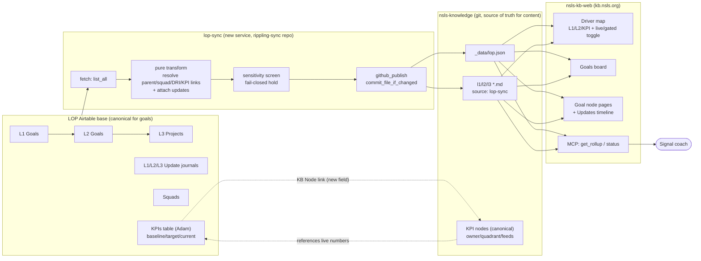

# feat: LOP → KB goal/project sync + KB↔LOP KPI reference join

## Summary

Mirror the LOP goal ladder (L1 → L2 → L3, their update journals, and Squads) from the LOP Airtable base into the KB as **read-only generated nodes**, and join the KB's KPI layer to Adam's live LOP KPIs table so the two reference each other without either becoming the other's copy. The Signal coach can then answer "what's driving this KPI, who owns it, is it live or gated?" from the KB MCP, and kb.nsls.org shows goals on the driver map and boards with an unmistakable live-vs-gated distinction.

Two source-of-truth directions, cleanly separated:
- **Goals/projects:** LOP base is canonical → sync one-way into the KB as generated `type: l1|l2|l3` nodes (never hand-edited).
- **KPIs:** the KB node is canonical (definition, owner, quadrant, causal graph) and is the *superset* across all four portfolio quadrants; the LOP KPIs table is a *reference* that holds the live numbers and links up to the KB node.

Target demo: a working vertical slice (L2/L3 sync → map with live/gated toggle → coach rollup answer) is demoable next week; L1, update-journal rendering, the goals board, and KPI reconciliation complete the plan.

---

## Problem Frame

Today the KB shows KPIs and topics, but not the work underway against them. "Which projects roll up to service quality, who owns them, and are they live or just an idea?" is unanswerable in the KB or the coach — that data lives only in the LOP Airtable base. Meanwhile the KB's KPI layer (32 harvested + pre-existing nodes) and Adam's new LOP KPIs table (created 2026-07-08) are two registries of the same concept drifting apart.

The opportunity: the LOP base *already* carries project → KPI links, DRIs, status, and update journals as structured data. Surfacing it in the KB is low-invention, high-clarity — and makes the coach materially more useful. The risk to manage: the LOP base changes constantly (≈239 L3 records, weekly status flips), so the mirror must be one-way and read-only, and the company must never confuse a gated idea for committed work.

**Requirements**

- **R1** — Sync L1/L2/L3 goals from the LOP base into nsls-knowledge as read-only generated nodes, pulling all fields, on a recurring cron.
- **R2** — Carry live-vs-gated status precisely; the KB default view shows only live work (Active / In progress), and gated/idea/planned/deferred/archived render with a clear status badge behind a toggle.
- **R3** — Pull all L1/L2/L3 update journals (health + comment + date) and render them publicly on the goal node.
- **R4** — Sync Squad membership so the map's "my squad" scope filter has data.
- **R5** — Make the KB node the canonical home for a KPI; add a "KB Node" link field to the LOP KPIs table; the KB references the LOP row for live numbers. Reconcile the 32 KB KPI nodes against Adam's table.
- **R6** — Expose goals + KPI rollups via the KB MCP so the coach answers "what rolls up to this KPI, who owns it, is it live or gated."
- **R7** — Show goals on the driver map (L1/L2/KPI; not all 239 L3s) and on a goals board; L3 projects are reachable via boards, node pages, and MCP.
- **R8** — Before first publish, screen free-text goal fields for the rubric's never-write case (a named individual tied to a personnel/HR status change); hold flagged rows for review, fail-closed. Do not scrub goals, targets, or strategy.
- **R9** — Generated nodes are visibly read-only (provenance flag + banner) and non-editable in the kb.nsls.org edit UI.

---

## Key Technical Decisions

**KTD1 — Direct-to-git sync, new service, reuse rippling-sync's libraries.** The sync writes generated files straight to `thensls/nsls-knowledge` via the GitHub Contents API (token auth), exactly as rippling-sync commits `org-chart.md`. It does **not** go through kb-gateway — the gateway's write API is per-field, single-line, top-level-only, and rejects `last-updated`, unfit for bulk multi-line nodes. Host it as a **new `lop-sync` module + Railway service inside the rippling-sync repo**, reusing `src/airtable.py` (`list_all`/`_request`), `src/github_publish.py` (`commit_file_if_changed`, `get_file_text`), and the pure-transform + fixtures test pattern verbatim. rippling-sync's DESIGN.md already names LOP sync a non-goal of *that* service ("goals are Airtable-owned"), so it gets its own entrypoint, `railway.toml` cron, and `LOP_AIRTABLE_BASE_ID`. *Alternative rejected:* a brand-new repo — more setup for no gain since the libraries are in rippling-sync.

**KTD2 — Dual artifact: `_data/lop.json` + per-goal markdown nodes.** Mirror the employees.json + org-chart.md pattern. `_data/lop.json` carries the full structured payload (every L1/L2/L3, all updates, squad membership, KPI links, status) for the site's filters, boards, and MCP to consume richly; per-goal `.md` files carry the KB frontmatter + body (description + `## Updates`) so goals are first-class nodes on the map/graph/pages. The JSON is the machine contract; the markdown is the human/graph node.

**KTD3 — SoT directions are asymmetric and explicit.** Goals: LOP → KB, one-way, generated, read-only. KPIs: KB node canonical (definition/owner/quadrant/feeds — the superset across all four quadrants); the LOP KPIs table is a reference holding live numbers (baseline/target/current/attainment) with a "KB Node" link field pointing at the canonical node. Numbers stay in Airtable, referenced — consistent with the rubric that keeps targets out of git. **The "KB Node" URL field already exists** on the KPIs table (`tbl4a2uBbBpdzNxZL`, field `fld3hpnIPtJafzBb8`, added 2026-07-11) — U6 populates it from the crosswalk, no field-add needed.

**KTD4 — Add `type: l1`; reconcile with existing theme-L1s.** The schema has no `l1` value (L1s are `type: theme` + `lop_level: "L1"`, e.g. `core-revenue.md`). Add `type: l1` for a clean l1/l2/l3 generated set. Where a synced L1 goal matches an existing theme-L1 by title, the generated node links to it (`related`) rather than duplicating; net-new L1s become generated nodes. (Open question OQ2 tracks whether to fold or keep separate.)

**KTD5 — Map shows L1/L2/KPI; L3s live on boards + pages + MCP.** 239 L3 nodes would swamp the driver map (Kevin: "mapping all of them will be overwhelming"). The map renders L1/L2/KPI and treats L3 projects as children reachable by focus/expand, on the goals board, and via MCP — not as top-level map nodes by default.

**KTD6 — Live-vs-gated rendering rule.** "Live" = L1 `Active`, L2 `Active`, L3 `In progress`. Everything else (Gate Dependent, Idea, Planned, Needs Finalization, Deferred, Archive, Complete) renders with a status badge and is filtered out of the default view, shown via a toggle that clones the existing `kind`-pill pattern in `app/map/page.tsx`. Status flows through a new `status_lop` → normalized `live | gated | other` field on the node payload.

**KTD7 — Provenance + read-only.** Generated nodes carry `source: lop-sync` frontmatter + a "do not edit — regenerated each sync" body banner (the `org-chart.md` convention). kb.nsls.org's edit UI hides/disables editing for `source: lop-sync` nodes. Slugs are deterministic from the goal's Airtable record; collisions with the 10 existing harvest-authored l2/l3 nodes are reconciled in U7 (lop-sync-backed node wins; harvest stub merged/retired).

**KTD8 — Light, fail-closed sensitivity screen.** Kevin's stance: LOPs are internally public — do not scrub goals/targets/strategy. The screen is a narrow backstop over free-text fields (L3 Description/Notes, update comments) for the rubric's never-write case (named individual + personnel/HR status change). A pattern/deny-list pass with an optional LLM check; a hit *holds* the whole goal from publish and lists it in the run report — never a silent rewrite. Recorded assumption A1: the LOP base is visible to all employees (sizes how light this stays).

**KTD9 — KPI crosswalk.** Reconcile the LOP KPIs-table rows and the 15 free-text "High Level KPI" tags (Invite List Size, Chapter Health, Product UX, Response Rate, Chapter Retention, Simplification, Internal Alignment, LTV Growth, Sales, TOFU, Branding, Testing Capabilities, Shop Revenue, Induction, Product Engagement) against the 32 KB KPI slugs. Deterministic name-match where clean (Response Rate → response-rate, Chapter Retention → chapter-retention, Branding → brand-power); a small hand-authored crosswalk file resolves LOP-only themes. The crosswalk is committed (`_data/lop-kpi-crosswalk.json`) so both the sync and the reconciliation read one source.

---

## High-Level Technical Design



The diagram is authoritative for data flow and SoT direction. The dashed KPI↔table edges are the bidirectional reference join (KTD3): the KB node stays canonical; the Airtable row holds numbers and a link back.

---

## Output Structure

New sync module in the rippling-sync repo:

```
src/lop/
  __init__.py
  main.py            # entrypoint: fetch → transform → screen → publish (parallels src/main.py)
  airtable_lop.py    # LOP base table/field-ID constants + fetch_l1/l2/l3/updates/squads/kpis
  lop_nodes.py       # pure transform: build_goals(), build_goal_md(), build_lop_json()
  screen.py          # sensitivity screen (fail-closed hold)
tests/
  test_lop_nodes.py
  test_lop_screen.py
  test_lop_airtable.py
railway.lop.toml     # or a second [service] — own cronSchedule + startCommand
```

Generated into nsls-knowledge: `_data/lop.json`, `_data/lop-kpi-crosswalk.json`, and one `<goal-slug>.md` per L1/L2/L3.

---

## Implementation Units

### U1. LOP Airtable read layer

**Goal:** Fetch L1/L2/L3 goals, their update journals, Squads, and the KPIs table from the LOP base.
**Requirements:** R1, R3, R4, R5.
**Dependencies:** none.
**Files:** `src/lop/airtable_lop.py`, `tests/test_lop_airtable.py`.
**Approach:** New module of table/field-ID constants for base `appAcnl4o8AQVZR1j` — L1 `tblFLHHpQUVpLrDjb`, L2 `tblpvFlUEy9GJflzB`, L3 `tblO76GbG5jwGukUn`, Squads `tblMV6Sk3dUvXh8Wx`, KPIs `tbl4a2uBbBpdzNxZL`, plus the three Goal-Updates tables. Reuse `airtable.list_all(base, table, key, fields, return_field_ids=True)` and `_request` (retry/backoff) verbatim. `fetch_l1/l2/l3/squads/kpis/updates` return raw field-ID-keyed rows. Read all fields per row (Kevin's directive) — pass `fields=None` or the full field-ID list.
**Patterns to follow:** `src/airtable.py` constants block + `fetch_employees`; field-ID-keyed reads.
**Test scenarios:** happy — `fetch_l3` paginates past 100 records (mock `_request` to return an `offset` then none); field-ID constants resolve against a captured fixture row; `fetch_updates` groups updates by parent goal link. Edge — empty table returns `[]`; a row missing an optional linked field doesn't raise. Error — a 429 from `_request` retries then succeeds (reuse the existing retry test pattern).
**Verification:** running against a fixture returns typed lists for all six tables with linked-record IDs intact.

### U2. Pure transform → goal nodes + `_data/lop.json`

**Goal:** Turn raw LOP rows into generated markdown nodes and the structured JSON payload.
**Requirements:** R1, R2, R3, R4, R5, R7.
**Dependencies:** U1.
**Files:** `src/lop/lop_nodes.py`, `tests/test_lop_nodes.py`.
**Approach:** Pure, no I/O (mirror `src/orgchart.py`). Two-pass linked-record resolution (copy `_row_to_person`'s manager-link pattern): build record-ID → slug/name maps, then resolve L3→L2→L1 `parent` links, Squad membership, DRI/owner (via `_data/employees.json` email map for avatars), and KPI links (from the KPIs table `Contributing Projects` + `High Level KPI` tags through `_data/lop-kpi-crosswalk.json`). Attach each goal's update journal (health + comment + date, sorted). `build_goal_md(goal)` emits KB frontmatter — `type: l1|l2|l3`, `parent`, `owner`, `contributors`, `lop_level`, `due`, `status: populated`, `status_lop` (raw), a normalized `lifecycle: live|gated|other` (KTD6), `quarter`, `squad`, `kpi_links` (feeds → KB KPI slugs), `source: lop-sync`, `audience: shared`, and the L3 `project_home` — plus a "do not edit" banner, the description, and a `## Updates` dated timeline. `build_lop_json(goals, squads, updates)` emits `{updated_at, source, goals, squads}`. Deterministic slug from Project Name (slugified, collision-suffixed).
**Patterns to follow:** `src/orgchart.py` `build_people`/`build_org_chart_md`/`build_employees_json`; the `## Key Decisions` dated-line body convention in existing KB nodes for `## Updates`.
**Test scenarios:** happy — an L3 row with an L2 parent + squad + DRI + KPI tag produces frontmatter with correct `parent`/`owner`/`squad`/`kpi_links` wikilinks and a `## Updates` section listing its journal entries newest-first; `lifecycle` maps `In progress`→live, `Gate Dependent`→gated, `Complete`→other (KTD6 table). Edge — a goal with no updates renders `## Updates` with a "no updates yet" line; a goal with no DRI omits `owner`; an L1 with no matching theme still emits a `type: l1` node. Integration — `build_lop_json` round-trips every goal that `build_goal_md` emitted (counts match; no goal in one artifact missing from the other). No comp/target leakage into node bodies beyond the goal's own name.
**Verification:** given a fixture set, emits N markdown strings + one JSON string with consistent counts and valid frontmatter.

### U3. Sensitivity screen

**Goal:** Hold goals whose free text names an individual tied to a personnel/HR status change; never rewrite.
**Requirements:** R8.
**Dependencies:** U1.
**Files:** `src/lop/screen.py`, `tests/test_lop_screen.py`.
**Approach:** `screen_goal(goal) -> ScreenResult{ok, reasons}` over Description/Notes/update-comment text. A pattern/deny-list pass (person-name token adjacent to terms like terminate, let go, PIP, demote, restructure-out, leave, complaint); optional LLM check gated by an env flag for the ambiguous middle. `partition(goals)` returns `(publishable, held)`; held goals are excluded from publish and listed in the run report (DM to Kevin). Fail-closed: any screen error → held. Keep it light per KTD8.
**Execution note:** Test-first — the never-write categories are the whole point; write the failing sensitive-detection tests first.
**Test scenarios:** happy — a clean project ("Improve Shopify backend…") passes; a row naming a person + a termination action is held with a reason. Edge — a goal mentioning a role but no person ("hire a data analyst") passes; empty text passes. Error — the LLM check raising → held (fail-closed), logged. Integration — `partition` keeps counts consistent (publishable + held = total).
**Verification:** sensitive fixtures are held; clean fixtures pass; the report lists held goals with reasons.

### U4. Orchestrator + publish + Railway service

**Goal:** Wire fetch → transform → screen → publish on a cron as its own service.
**Requirements:** R1, R8, R9.
**Dependencies:** U1, U2, U3.
**Files:** `src/lop/main.py`, `src/lop/__init__.py`, `railway.lop.toml` (or a second service block), `tests/test_lop_nodes.py` (orchestration seam).
**Approach:** `main(argv)` parallels `src/main.py`: fetch all tables (U1) → transform (U2) → screen/partition (U3) → for each publishable goal, `github_publish.commit_file_if_changed(path="<slug>.md", …)`; write `_data/lop.json` and `_data/lop-kpi-crosswalk.json` the same way. Idempotent per-file commits (no-op unless changed) keep ~239 files cheap. `--dry-run`/`--once` flags. Pull/rebase discipline before push (rippling-sync + harvest + lop-sync all push `main`). New Doppler `LOP_AIRTABLE_BASE_ID` (+ reuse `AIRTABLE_API_KEY`, `GITHUB_TOKEN`, Kevin Slack token for the report). Cron hourly to start (tunable); commit message `chore(lop-sync): refresh goals (N nodes, <ts>)`.
**Patterns to follow:** `src/main.py:258-311` publish block; `railway.toml` `[deploy] cronSchedule`.
**Test scenarios:** happy — a full dry-run over fixtures reports the node/held counts without writing; a changed goal produces one commit, an unchanged one produces none (mock `commit_file_if_changed`). Edge — zero publishable goals still writes `_data/lop.json`. Error — a publish failure on one node is logged and does not abort the rest (fan-out, not chain); Kevin gets a warning DM.
**Verification:** `python -m src.lop.main --once --dry-run` prints a correct plan; a live `--once` commits changed nodes + JSON and skips unchanged.

### U5. KB schema: `type: l1`, LOP fields, read-only provenance

**Goal:** Document the generated goal-node schema and the read-only convention.
**Requirements:** R1, R9.
**Dependencies:** none (can land first).
**Files:** `nsls-knowledge/CLAUDE.md`.
**Approach:** Add `l1` to the `type` enum; document `status_lop`, `lifecycle`, `quarter`, `squad`, `kpi_links`, and `source: lop-sync` (read-only/generated marker). State the rule: `source: lop-sync` nodes are machine-generated, never hand-edited, and non-editable in the web UI. Note L1↔theme reconciliation (KTD4).
**Test scenarios:** Test expectation: none — documentation only.
**Verification:** schema table lists the new fields; the generated-node convention is written down.

### U6. KPI reconciliation + Airtable "KB Node" link field

**Goal:** Join the KB KPI layer to Adam's LOP KPIs table both directions.
**Requirements:** R5.
**Dependencies:** U2 (crosswalk consumed by the sync).
**Files:** `_data/lop-kpi-crosswalk.json` (nsls-knowledge), reconciliation notes in the harvest project doc; a one-time Airtable field-add on `tbl4a2uBbBpdzNxZL`.
**Approach:** Build the crosswalk (KTD9) — deterministic name-matches plus hand-authored entries for LOP-only tags. Populate the existing **"KB Node"** URL field (`fld3hpnIPtJafzBb8`) on the LOP KPIs table from the crosswalk (field already added 2026-07-11 — do not re-create it). Reconcile the 32 KB KPI nodes against Adam's rows: where both exist, link them and keep the KB node's quadrant tag; where the KB lacks a node for a tracked LOP KPI, create one; KB-only KPIs (efficiency/hygiene/reliability quadrants) stay.
**Test scenarios:** happy — every LOP KPIs row resolves to exactly one KB slug or is flagged unmatched; the crosswalk covers all 15 High Level KPI tags. Edge — an ambiguous LOP-only tag routes to its hand-authored crosswalk entry, not a bad auto-match. Integration — the sync (U2) reads the crosswalk and produces valid `kpi_links` wikilinks that resolve to real KB nodes.
**Verification:** crosswalk resolves all tags; KPIs table rows carry KB Node links; no orphan `kpi_links` in generated nodes.

### U7. Reconcile existing harvest l2/l3 nodes

**Goal:** Prevent duplicate/competing goal nodes between the 10 harvest-authored l2/l3 files and lop-sync output.
**Requirements:** R1.
**Dependencies:** U2.
**Files:** the affected existing `*.md` in nsls-knowledge (merge/retire), `src/lop/lop_nodes.py` (slug-collision handling).
**Approach:** Match harvest l2/l3 nodes to lop-sync goals by title. On a match, the lop-sync-backed node is canonical; carry any hand-written body insight into the LOP goal's Airtable Description (so it survives regeneration) or retire the harvest stub. lop-sync's deterministic slug avoids clobbering unrelated nodes; a collision on a non-matching slug gets a suffix.
**Test scenarios:** happy — a harvest l3 whose title matches a LOP L3 is identified for merge; a harvest node with no LOP match is left untouched. Edge — two LOP goals slugifying to the same base get distinct suffixed slugs.
**Verification:** no two nodes describe the same goal; no hand-authored non-goal node is overwritten.

### U8. KB-web: load + model goal nodes

**Goal:** Make l1/l2/l3 nodes first-class in the site's data layer.
**Requirements:** R1, R2, R7.
**Dependencies:** U2 (produces the content it reads).
**Files:** `lib/kb/read.ts`, `lib/kb/model.ts`, `lib/kb/graph.ts`, `lib/kb/lop.ts` (new, reads `_data/lop.json`), co-located `.test.ts`.
**Approach:** In `parseKbFile`, parse the new fields onto `KbNode` (`statusLop`, `lifecycle`, `quarter`, `squad`, `kpiLinks`, `source`) — reuse `asKind`/`asOptionalString` converters; `status` is already parsed. In `model.ts` add the fields + `l1|l2|l3` to the `type` union. In `graph.ts` add `l1/l2/l3` to a `GOAL_TYPES` set and include L1/L2 (not L3) in the map subgraph (KTD5); wire `routeForSlug`. New `lib/kb/lop.ts` loads `_data/lop.json` for richer data (all updates, squad rosters) the flat markdown doesn't carry.
**Patterns to follow:** `lib/kb/people.ts` mtime-cached JSON loader; `KPI_TYPES` gate in `graph.ts`.
**Test scenarios:** happy — a goal `.md` parses `lifecycle`/`squad`/`kpiLinks`; an L2 enters the map subgraph, an L3 does not. Edge — a node missing `lifecycle` defaults to `other`; `lib/kb/lop.ts` returns empty when `_data/lop.json` is absent (never throws). Integration — `buildGraph` produces `feeds` edges from a goal's `kpiLinks` to the KPI node.
**Verification:** goal nodes load with all fields; L1/L2 appear in the subgraph, L3 excluded.

### U9. KB-web: map badges + live/gated toggle

**Goal:** Goals on the driver map with a status badge and a live/gated filter.
**Requirements:** R2, R7.
**Dependencies:** U8.
**Files:** `components/KpiGraph.tsx`, `lib/kb/map-data.ts`, `app/map/page.tsx`, co-located `.test.ts`/`.test.tsx`.
**Approach:** Add `l1/l2/l3` to `TYPE_BADGE_CLASSES` and a `lifecycle` field to `KpiMapNode` + the `map-data.ts` serializer. In `KpiGraph`, render a status badge in `KbNodeCard` next to the `lopLevel` badge (teal = live, amber/rose = gated per existing token usage). In `app/map/page.tsx`, add a `status` URL param + keep-set filter and a third pill group ("Live / All"), cloning the existing `kind`-pill pattern; default view = live only (KTD6).
**Patterns to follow:** `app/map/page.tsx` `kind`/`mine` pills + `mapHref` + `pillActive/pillIdle`; `KpiGraph` `lopLevel` badge at line ~87.
**Test scenarios:** happy — default map excludes gated nodes; toggling "All" includes them; a gated L2 shows the gated badge. Edge — no goal nodes → map renders KPIs unchanged. Integration — `mapHref` round-trips the `status` param and the server-side keep-set matches.
**Verification:** the map shows L1/L2/KPI with correct badges and a working live/gated toggle.

### U10. KB-web: goal node pages + Updates timeline + read-only

**Goal:** Goal node pages that render the update journal and are non-editable.
**Requirements:** R3, R9.
**Dependencies:** U8.
**Files:** `app/kpi/[slug]/page.tsx` (or a goal route), `components/NodeBadges.tsx`, a new `components/UpdatesTimeline.tsx`, `app/edit/[slug]/*` (read-only guard), co-located tests.
**Approach:** Goal types added to `isKpi`/routing get node pages automatically (research §3). Add a status/gated badge to `NodeBadges`. Render `## Updates` (from the node body) or the richer journal from `lib/kb/lop.ts` as a dated health+comment timeline. In the edit route, detect `source: lop-sync` and show a read-only notice instead of the editor (server-side guard, mirroring the owner gate in `lib/kb/ownership.ts`).
**Patterns to follow:** `components/NodeBadges.tsx`, `components/NodeHistory.tsx` (timeline shape), `lib/kb/ownership.ts` (server-side gate).
**Test scenarios:** happy — a goal page shows its updates newest-first + a live/gated badge. Edge — a goal with no updates shows an empty-state; a `source: lop-sync` node renders read-only, no edit form. Error — attempting a POST edit on a lop-sync node via `node-actions` is rejected server-side.
**Verification:** goal pages render updates and status; generated nodes cannot be edited in the UI.

### U11. KB-web: goals board

**Goal:** A board listing goals grouped by status/quadrant/squad.
**Requirements:** R7.
**Dependencies:** U8.
**Files:** `app/boards/goals/page.tsx`, `app/boards/BoardsView.tsx` (generalize), `lib/kb/boards.ts`, co-located tests.
**Approach:** Generalize `byKind` (keys on `kind`) to also select by goal `type`; add a goals `BoardsView` variant grouping by `lifecycle` (live first) then quarter/squad, with the `?mine=1` regrouping already supported via `byPerson`. Add a nav pill alongside KPI/Topics.
**Patterns to follow:** `app/boards/BoardsView.tsx`, `components/BoardCard.tsx`, `lib/kb/boards.ts` selectors.
**Test scenarios:** happy — the board lists L2/L3 goals grouped live-first; `?mine=1` regroups to the viewer's accountable/contributing goals. Edge — a person with no goals sees an empty state. Integration — board counts match the loaded goal nodes.
**Verification:** the goals board renders grouped goals and the mine filter works.

### U12. KB-web: MCP rollup + status

**Goal:** The coach can answer "what rolls up to this KPI, who owns it, live or gated."
**Requirements:** R6.
**Dependencies:** U8.
**Files:** `lib/kb/query.ts`, `app/mcp/route.ts`, co-located `.test.ts`.
**Approach:** Add `lifecycle`/`statusLop`/`quadrant`/goal fields to `ArticleResult` (+ `toArticle`) and to `KpiGraphResult` nodes (+ `getKpiGraph`). Add a `get_rollup(slug)` tool: walk `buildGraph().fedBy`/`children` from a KPI to its contributing L2/L3 goals, attaching owner + lifecycle + quarter, so one call answers the composite question. Register it with `server.tool(...)` wrapping `json(result)`.
**Patterns to follow:** `lib/kb/query.ts` result shapes (pinned wire contract); `app/mcp/route.ts` `server.tool` blocks.
**Test scenarios:** happy — `get_rollup('service-quality-sla')` returns its contributing goals with owner + live/gated; `get_kpi_graph` nodes carry `lifecycle`. Edge — a KPI with no goals returns an empty rollup, not an error; an unknown slug returns the not-found shape with suggestions. Integration — the rollup owner/status matches the underlying goal nodes.
**Verification:** the MCP tool answers the composite question from fixture content; existing tools still pass.

---

## Scope Boundaries

**In scope (v1):** L1/L2/L3 goal sync (all fields), all update journals rendered, Squads, the KPI reference join + reconciliation, live/gated toggle UI, goals board, MCP rollup, read-only provenance, the sensitivity backstop.

**Deferred to Follow-Up Work:**
- The Membership Evolution Roadmap narrative layer (`tblcmBVPyrwFwXN3r`).
- mine/dept/squad *scope* filters beyond the existing `mine` and the new squad data (the filter UI for dept/squad is a fast-follow once squad data lands).
- Two-way editing of goals from the KB (goals stay Airtable-owned; the KB is read-only for them).
- Folding vs. keeping-separate the existing theme-L1s (OQ2) if it turns out to need a data cleanup pass.

**Out of scope:** scrubbing goals/targets/strategy (KTD8); copying KPI numbers into git (they stay in Airtable, referenced); writing back to the LOP base beyond the one "KB Node" field.

---

## Open Questions

- **OQ1** — Is the LOP base visible to all ~60 employees today, or SLT/manager-scoped? Confirms how light the sensitivity screen (U3) can stay. Assumption A1 (internally public) holds until confirmed.
- **OQ2** — Fold synced L1 goals into the existing theme-L1 nodes (`core-revenue`, `product-engagement`) or keep a distinct `type: l1` set linked to them? Default: keep separate + link (KTD4); revisit if it reads as duplication.
- **OQ3** — Sync cadence: hourly (matches rippling-sync) vs. less frequent given ~239 nodes? Default hourly; idempotent commits make it cheap.
- **OQ4** — RESOLVED 2026-07-11: the "KB Node" URL field is added (`fld3hpnIPtJafzBb8`). U6 populates it; no coordination gate remains.

---

## Risks & Dependencies

- **Concurrent pushes to `main`** (rippling-sync + harvest + lop-sync). Mitigate: pull `--ff-only`/rebase before push; per-file idempotent commits.
- **Slug collisions** clobbering hand-authored nodes. Mitigate: deterministic slug + suffix on collision; U7 reconciliation; `source: lop-sync` marks generated files.
- **Sensitive leak via update-journal free text.** Mitigate: U3 fail-closed screen before first publish; Kevin's internal-public stance recorded as A1.
- **Map overwhelm from 239 L3s.** Mitigate: KTD5 (map = L1/L2/KPI only).
- **Adam's KPIs backfill in flight.** Mitigate: OQ4 coordination; hold the field-add until populatable.
- **Dependency:** `_data/employees.json` (rippling-sync) must exist for DRI avatar resolution — it does.

---

## Definition of Done

- lop-sync runs on a cron, publishing `_data/lop.json` + per-goal `.md` nodes (L1/L2/L3) with correct status/lifecycle/updates/KPI links and `source: lop-sync`; unchanged nodes produce no commits.
- The sensitivity screen holds flagged goals and reports them; nothing sensitive publishes.
- kb.nsls.org shows goals on the map with a working live/gated toggle, goal pages render the update timeline, and generated nodes are read-only.
- The goals board and MCP `get_rollup` answer "what rolls up to this KPI, who owns it, live or gated."
- The KPI crosswalk resolves all LOP tags; the KPIs table carries KB Node links; the 32 KB KPI nodes are reconciled against Adam's table with quadrant tags preserved.
- All units' test scenarios pass in `pytest` (lop-sync) and `vitest` (kb-web).

---

## Verification Contract

- **lop-sync:** `python -m src.lop.main --once --dry-run` prints a correct node/held plan; `pytest tests/test_lop_*.py` green. Pure transforms tested without network; screen tested with sensitive+clean fixtures.
- **nsls-kb-web:** `npm test` green; new co-located tests for read/model, map filter, MCP rollup, and the read-only edit guard.
- **End-to-end:** after a live `--once`, a KPI page on kb.nsls.org lists its contributing goals with live/gated status, and the coach's `get_rollup` returns the same.

---

## Sources & Research

- rippling-sync: `src/airtable.py` (`list_all`/`_request`), `src/orgchart.py` (pure transform), `src/github_publish.py` (`commit_file_if_changed`/`get_file_text`), `src/slack.py` (staleness gate), `railway.toml` cron, `DESIGN.md` (LOP = non-goal of that service), `tests/` fixture pattern.
- nsls-kb-web: `lib/kb/read.ts` (`parseKbFile`), `lib/kb/model.ts` (`KbNode`), `lib/kb/graph.ts` (`KPI_TYPES`/routing), `lib/kb/map-data.ts`, `app/map/page.tsx` (existing filter system), `app/boards/BoardsView.tsx`, `app/mcp/route.ts` + `lib/kb/query.ts` (MCP wire contract), `components/{KpiGraph,NodeBadges,Avatar,OwnershipHeader}.tsx`, `lib/kb/{people,history,ownership,boards}.ts`.
- nsls-knowledge: `CLAUDE.md` (schema + sensitive-content rubric), live `type: l2/l3` nodes, `project-portfolio-framework.md` (quadrant), `_data/employees.json` + `org-chart.md` (generated-content precedent).
- kb-gateway: `app.py` endpoints + `kb_edits.apply_edit` (why bulk sync bypasses it), GitHub App auth.
- LOP Airtable base `appAcnl4o8AQVZR1j`: L1/L2/L3 + Update journals + Squads + KPIs table schema and the status/gating choice lists (Active/Archive; Active/Gate Dependent/Needs Finalization/Complete; Idea/Planned/In progress/Complete/Deferred/Gate Dependent).
